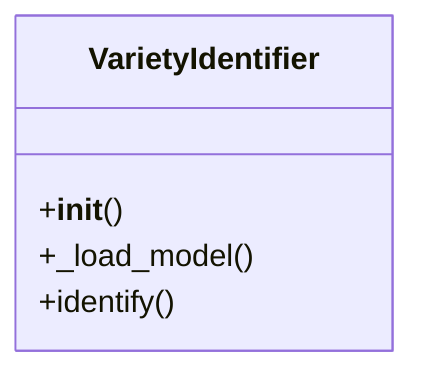

# ai_modules.services.variety_identifier

## Imports
- PIL
- logging
- os
- sys
- time
- torch
- torchvision
- traceback

## Classes
- VarietyIdentifier
  - method: `__init__`
  - method: `_load_model`
  - method: `identify`

## Functions
- __init__
- _load_model
- identify

## Module Variables
- `logger`
- `handler`
- `formatter`

## Class Diagram

