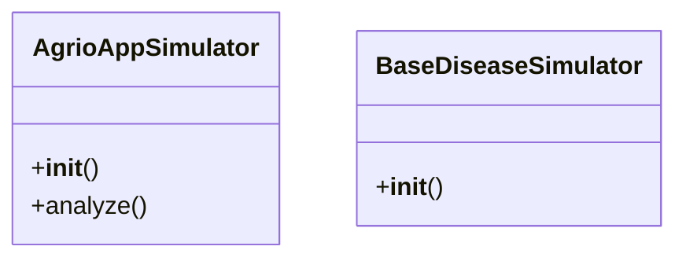

# ai_modules.simulated_tools.agrio_app_simulator

## Imports
- base_simulator
- logging
- os
- utils.image_processing

## Classes
- AgrioAppSimulator
  - method: `__init__`
  - method: `analyze`
- BaseDiseaseSimulator
  - method: `__init__`

## Functions
- __init__
- analyze
- read_image
- calculate_yellow_percentage
- __init__

## Module Variables
- `logger`

## Class Diagram

