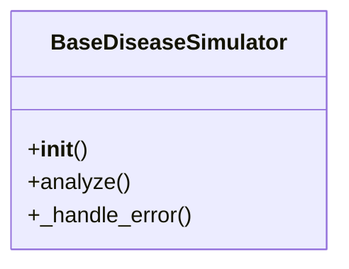

# ai_modules.simulated_tools.base_simulator

## Imports
- abc
- logging

## Classes
- BaseDiseaseSimulator
  - method: `__init__`
  - method: `analyze`
  - method: `_handle_error`

## Functions
- __init__
- analyze
- _handle_error

## Module Variables
- `logger`

## Class Diagram

