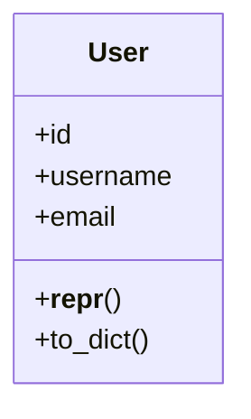

# api_server.src.models.user

## Imports
- flask_sqlalchemy

## Classes
- User
  - attr: `id`
  - attr: `username`
  - attr: `email`
  - method: `__repr__`
  - method: `to_dict`

## Functions
- __repr__
- to_dict

## Module Variables
- `db`

## Class Diagram

