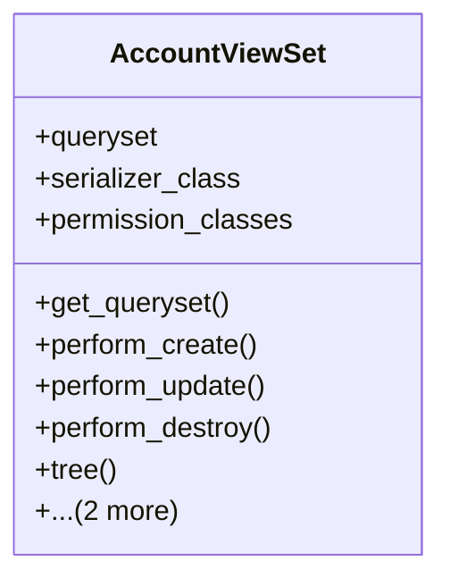

# business_modules.accounting.api.account_api

## Imports
- core_modules.core.models
- datetime
- django.utils.translation
- models
- rest_framework
- rest_framework.decorators
- rest_framework.response
- serializers
- services.account_service

## Classes
- AccountViewSet
  - attr: `queryset`
  - attr: `serializer_class`
  - attr: `permission_classes`
  - method: `get_queryset`
  - method: `perform_create`
  - method: `perform_update`
  - method: `perform_destroy`
  - method: `tree`
  - method: `balance_sheet`
  - method: `income_statement`

## Functions
- get_queryset
- perform_create
- perform_update
- perform_destroy
- tree
- balance_sheet
- income_statement

## Class Diagram

