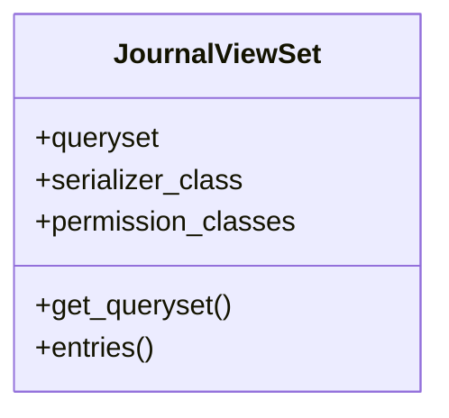

# business_modules.accounting.api.journal_api

## Imports
- django.utils.translation
- models
- rest_framework
- rest_framework.decorators
- rest_framework.response
- serializers

## Classes
- JournalViewSet
  - attr: `queryset`
  - attr: `serializer_class`
  - attr: `permission_classes`
  - method: `get_queryset`
  - method: `entries`

## Functions
- get_queryset
- entries

## Class Diagram

