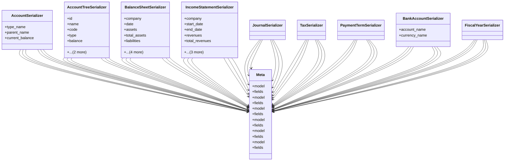

# business_modules.accounting.api.serializers

## Imports
- django.db
- models
- rest_framework

## Classes
- AccountSerializer
  - attr: `type_name`
  - attr: `parent_name`
  - attr: `current_balance`
- AccountTreeSerializer
  - attr: `id`
  - attr: `name`
  - attr: `code`
  - attr: `type`
  - attr: `balance`
  - attr: `is_active`
  - attr: `children`
- BalanceSheetSerializer
  - attr: `company`
  - attr: `date`
  - attr: `assets`
  - attr: `total_assets`
  - attr: `liabilities`
  - attr: `total_liabilities`
  - attr: `equity`
  - attr: `total_equity`
  - attr: `total_liabilities_equity`
- IncomeStatementSerializer
  - attr: `company`
  - attr: `start_date`
  - attr: `end_date`
  - attr: `revenues`
  - attr: `total_revenues`
  - attr: `expenses`
  - attr: `total_expenses`
  - attr: `net_income`
- JournalSerializer
- TaxSerializer
- PaymentTermSerializer
- BankAccountSerializer
  - attr: `account_name`
  - attr: `currency_name`
- FiscalYearSerializer
- Meta
  - attr: `model`
  - attr: `fields`
- Meta
  - attr: `model`
  - attr: `fields`
- Meta
  - attr: `model`
  - attr: `fields`
- Meta
  - attr: `model`
  - attr: `fields`
- Meta
  - attr: `model`
  - attr: `fields`
- Meta
  - attr: `model`
  - attr: `fields`

## Class Diagram

