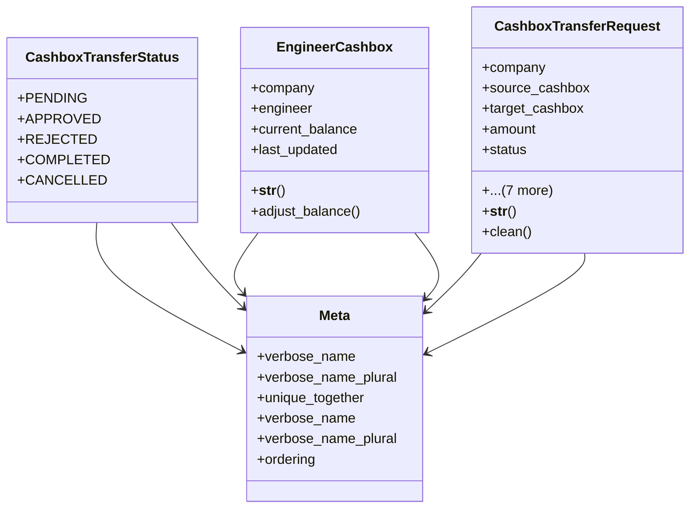

# business_modules.accounting.cashbox

## Imports
- core_modules.organization.models
- decimal
- django.conf
- django.contrib.auth.models
- django.core.exceptions
- django.db
- django.utils
- django.utils.translation

## Classes
- CashboxTransferStatus
  - attr: `PENDING`
  - attr: `APPROVED`
  - attr: `REJECTED`
  - attr: `COMPLETED`
  - attr: `CANCELLED`
- EngineerCashbox
  - attr: `company`
  - attr: `engineer`
  - attr: `current_balance`
  - attr: `last_updated`
  - method: `__str__`
  - method: `adjust_balance`
- CashboxTransferRequest
  - attr: `company`
  - attr: `source_cashbox`
  - attr: `target_cashbox`
  - attr: `amount`
  - attr: `status`
  - attr: `requested_by`
  - attr: `approved_by`
  - attr: `request_date`
  - attr: `approval_date`
  - attr: `completion_date`
  - attr: `notes`
  - attr: `rejection_reason`
  - method: `__str__`
  - method: `clean`
- Meta
  - attr: `verbose_name`
  - attr: `verbose_name_plural`
  - attr: `unique_together`
- Meta
  - attr: `verbose_name`
  - attr: `verbose_name_plural`
  - attr: `ordering`

## Functions
- __str__
- adjust_balance
- __str__
- clean

## Class Diagram

