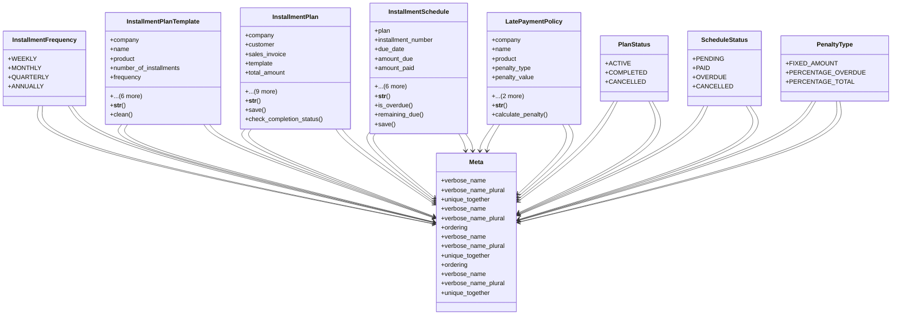

# business_modules.accounting.installments

## Imports
- business_modules.contacts.models
- business_modules.inventory.models
- core_modules.organization.models
- decimal
- django.core.exceptions
- django.db
- django.utils
- django.utils.translation
- invoices

## Classes
- InstallmentFrequency
  - attr: `WEEKLY`
  - attr: `MONTHLY`
  - attr: `QUARTERLY`
  - attr: `ANNUALLY`
- InstallmentPlanTemplate
  - attr: `company`
  - attr: `name`
  - attr: `product`
  - attr: `number_of_installments`
  - attr: `frequency`
  - attr: `requires_down_payment`
  - attr: `down_payment_percentage`
  - attr: `down_payment_fixed_amount`
  - attr: `is_active`
  - attr: `created_at`
  - attr: `updated_at`
  - method: `__str__`
  - method: `clean`
- InstallmentPlan
  - attr: `company`
  - attr: `customer`
  - attr: `sales_invoice`
  - attr: `template`
  - attr: `total_amount`
  - attr: `down_payment_amount`
  - attr: `installment_amount_total`
  - attr: `number_of_installments`
  - attr: `frequency`
  - attr: `start_date`
  - attr: `status`
  - attr: `notes`
  - attr: `created_at`
  - attr: `updated_at`
  - method: `__str__`
  - method: `save`
  - method: `check_completion_status`
- InstallmentSchedule
  - attr: `plan`
  - attr: `installment_number`
  - attr: `due_date`
  - attr: `amount_due`
  - attr: `amount_paid`
  - attr: `penalty_applied`
  - attr: `status`
  - attr: `payment_date`
  - attr: `notes`
  - attr: `created_at`
  - attr: `updated_at`
  - method: `__str__`
  - method: `is_overdue`
  - method: `remaining_due`
  - method: `save`
- LatePaymentPolicy
  - attr: `company`
  - attr: `name`
  - attr: `product`
  - attr: `penalty_type`
  - attr: `penalty_value`
  - attr: `grace_period_days`
  - attr: `is_active`
  - method: `__str__`
  - method: `calculate_penalty`
- Meta
  - attr: `verbose_name`
  - attr: `verbose_name_plural`
  - attr: `unique_together`
- PlanStatus
  - attr: `ACTIVE`
  - attr: `COMPLETED`
  - attr: `CANCELLED`
- Meta
  - attr: `verbose_name`
  - attr: `verbose_name_plural`
  - attr: `ordering`
- ScheduleStatus
  - attr: `PENDING`
  - attr: `PAID`
  - attr: `OVERDUE`
  - attr: `CANCELLED`
- Meta
  - attr: `verbose_name`
  - attr: `verbose_name_plural`
  - attr: `unique_together`
  - attr: `ordering`
- PenaltyType
  - attr: `FIXED_AMOUNT`
  - attr: `PERCENTAGE_OVERDUE`
  - attr: `PERCENTAGE_TOTAL`
- Meta
  - attr: `verbose_name`
  - attr: `verbose_name_plural`
  - attr: `unique_together`

## Functions
- __str__
- clean
- __str__
- save
- check_completion_status
- __str__
- is_overdue
- remaining_due
- save
- __str__
- calculate_penalty

## Class Diagram

