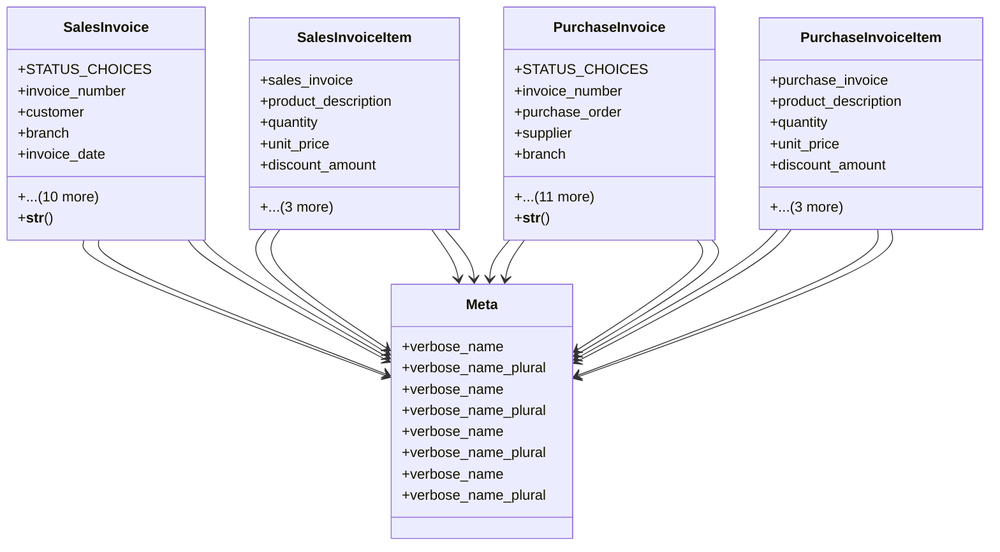

# business_modules.accounting.invoices

## Imports
- business_modules.accounting.models.tax
- business_modules.contacts.models
- business_modules.purchasing.models
- core_modules.organization.models
- decimal
- django.db
- django.utils.translation
- typing

## Classes
- SalesInvoice
  - attr: `STATUS_CHOICES`
  - attr: `invoice_number`
  - attr: `customer`
  - attr: `branch`
  - attr: `invoice_date`
  - attr: `due_date`
  - attr: `currency`
  - attr: `total_amount`
  - attr: `tax_amount`
  - attr: `net_amount`
  - attr: `paid_amount`
  - attr: `status`
  - attr: `notes`
  - attr: `created_at`
  - attr: `updated_at`
  - method: `__str__`
- SalesInvoiceItem
  - attr: `sales_invoice`
  - attr: `product_description`
  - attr: `quantity`
  - attr: `unit_price`
  - attr: `discount_amount`
  - attr: `tax`
  - attr: `tax_amount`
  - attr: `line_total`
- PurchaseInvoice
  - attr: `STATUS_CHOICES`
  - attr: `invoice_number`
  - attr: `purchase_order`
  - attr: `supplier`
  - attr: `branch`
  - attr: `invoice_date`
  - attr: `due_date`
  - attr: `currency`
  - attr: `total_amount`
  - attr: `tax_amount`
  - attr: `net_amount`
  - attr: `paid_amount`
  - attr: `status`
  - attr: `notes`
  - attr: `created_at`
  - attr: `updated_at`
  - method: `__str__`
- PurchaseInvoiceItem
  - attr: `purchase_invoice`
  - attr: `product_description`
  - attr: `quantity`
  - attr: `unit_price`
  - attr: `discount_amount`
  - attr: `tax`
  - attr: `tax_amount`
  - attr: `line_total`
- Meta
  - attr: `verbose_name`
  - attr: `verbose_name_plural`
- Meta
  - attr: `verbose_name`
  - attr: `verbose_name_plural`
- Meta
  - attr: `verbose_name`
  - attr: `verbose_name_plural`
- Meta
  - attr: `verbose_name`
  - attr: `verbose_name_plural`

## Functions
- __str__
- __str__

## Class Diagram

