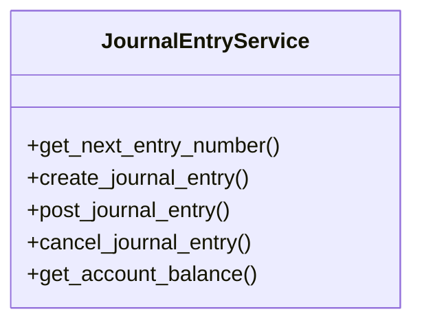

# business_modules.accounting.journal_entry_services_simple

## Imports
- core_modules.users.models
- datetime
- decimal
- django.core.exceptions
- django.db
- django.db.models
- django.utils
- django.utils.translation
- models
- typing

## Classes
- JournalEntryService
  - method: `get_next_entry_number`
  - method: `create_journal_entry`
  - method: `post_journal_entry`
  - method: `cancel_journal_entry`
  - method: `get_account_balance`

## Functions
- get_next_entry_number
- create_journal_entry
- post_journal_entry
- cancel_journal_entry
- get_account_balance

## Class Diagram

