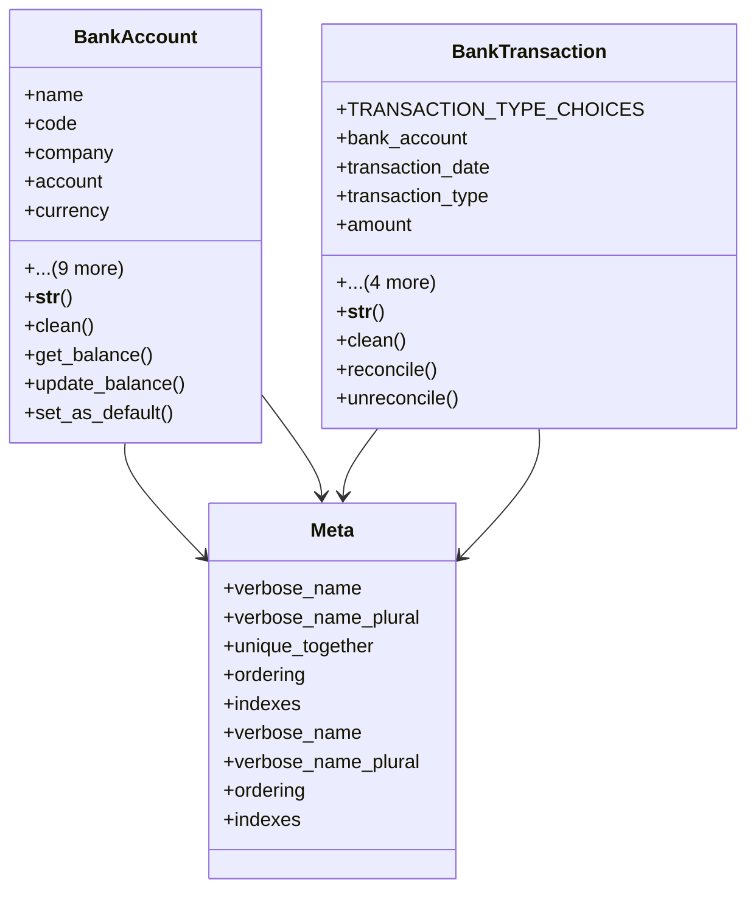

# business_modules.accounting.models.bank_account

## Imports
- account
- account_type
- business_modules.accounting.models
- core_modules.core.models
- django.core.exceptions
- django.db
- django.utils.translation

## Classes
- BankAccount
  - attr: `name`
  - attr: `code`
  - attr: `company`
  - attr: `account`
  - attr: `currency`
  - attr: `bank_name`
  - attr: `branch_name`
  - attr: `account_number`
  - attr: `iban`
  - attr: `swift_code`
  - attr: `partner`
  - attr: `is_active`
  - attr: `is_default`
  - attr: `notes`
  - method: `__str__`
  - method: `clean`
  - method: `get_balance`
  - method: `update_balance`
  - method: `set_as_default`
- BankTransaction
  - attr: `TRANSACTION_TYPE_CHOICES`
  - attr: `bank_account`
  - attr: `transaction_date`
  - attr: `transaction_type`
  - attr: `amount`
  - attr: `reference`
  - attr: `description`
  - attr: `partner`
  - attr: `is_reconciled`
  - method: `__str__`
  - method: `clean`
  - method: `reconcile`
  - method: `unreconcile`
- Meta
  - attr: `verbose_name`
  - attr: `verbose_name_plural`
  - attr: `unique_together`
  - attr: `ordering`
  - attr: `indexes`
- Meta
  - attr: `verbose_name`
  - attr: `verbose_name_plural`
  - attr: `ordering`
  - attr: `indexes`

## Functions
- __str__
- clean
- get_balance
- update_balance
- set_as_default
- __str__
- clean
- reconcile
- unreconcile

## Class Diagram

