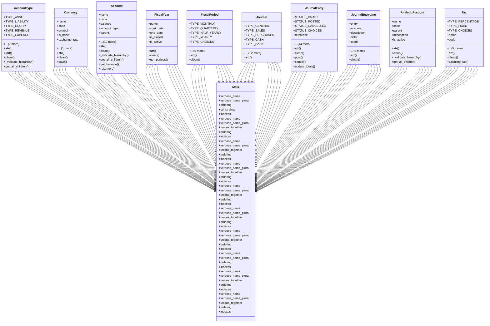

# business_modules.accounting.models

## Imports
- core_modules.companies.models
- core_modules.core.models
- decimal
- django.contrib.auth
- django.contrib.contenttypes.fields
- django.contrib.contenttypes.models
- django.core.exceptions
- django.db
- django.db.models
- django.utils
- django.utils.translation
- services
- typing

## Classes
- AccountType
  - attr: `TYPE_ASSET`
  - attr: `TYPE_LIABILITY`
  - attr: `TYPE_EQUITY`
  - attr: `TYPE_REVENUE`
  - attr: `TYPE_EXPENSE`
  - attr: `TYPE_CHOICES`
  - attr: `name`
  - attr: `code`
  - attr: `type`
  - attr: `parent`
  - attr: `description`
  - attr: `is_active`
  - method: `__str__`
  - method: `__init__`
  - method: `clean`
  - method: `_validate_hierarchy`
  - method: `get_all_children`
- Currency
  - attr: `name`
  - attr: `code`
  - attr: `symbol`
  - attr: `is_base`
  - attr: `exchange_rate`
  - attr: `is_active`
  - method: `__str__`
  - method: `clean`
  - method: `save`
- Account
  - attr: `name`
  - attr: `code`
  - attr: `balance`
  - attr: `account_type`
  - attr: `parent`
  - attr: `description`
  - attr: `is_active`
  - attr: `is_reconcilable`
  - attr: `opening_debit`
  - attr: `opening_credit`
  - attr: `current_debit`
  - attr: `current_credit`
  - attr: `currency`
  - attr: `branch`
  - attr: `department`
  - method: `__str__`
  - method: `clean`
  - method: `_validate_hierarchy`
  - method: `get_all_children`
  - method: `get_balance`
  - method: `update_balance`
- FiscalYear
  - attr: `name`
  - attr: `start_date`
  - attr: `end_date`
  - attr: `is_closed`
  - attr: `is_active`
  - method: `__str__`
  - method: `clean`
  - method: `get_periods`
- FiscalPeriod
  - attr: `TYPE_MONTHLY`
  - attr: `TYPE_QUARTERLY`
  - attr: `TYPE_HALF_YEARLY`
  - attr: `TYPE_YEARLY`
  - attr: `TYPE_CHOICES`
  - attr: `name`
  - attr: `fiscal_year`
  - attr: `type`
  - attr: `start_date`
  - attr: `end_date`
  - attr: `is_closed`
  - method: `__str__`
  - method: `clean`
- Journal
  - attr: `TYPE_GENERAL`
  - attr: `TYPE_SALES`
  - attr: `TYPE_PURCHASES`
  - attr: `TYPE_CASH`
  - attr: `TYPE_BANK`
  - attr: `TYPE_PAYROLL`
  - attr: `TYPE_FIXED_ASSETS`
  - attr: `TYPE_OPENING`
  - attr: `TYPE_CLOSING`
  - attr: `TYPE_CHOICES`
  - attr: `name`
  - attr: `code`
  - attr: `type`
  - attr: `description`
  - attr: `is_active`
  - attr: `branch`
  - attr: `department`
  - method: `__str__`
- JournalEntry
  - attr: `STATUS_DRAFT`
  - attr: `STATUS_POSTED`
  - attr: `STATUS_CANCELLED`
  - attr: `STATUS_CHOICES`
  - attr: `reference`
  - attr: `date`
  - attr: `journal`
  - attr: `description`
  - attr: `status`
  - attr: `fiscal_period`
  - attr: `total_debit`
  - attr: `total_credit`
  - attr: `content_type`
  - attr: `object_id`
  - attr: `content_object`
  - attr: `branch`
  - attr: `department`
  - attr: `posted_by`
  - attr: `posted_at`
  - method: `__str__`
  - method: `clean`
  - method: `post`
  - method: `cancel`
  - method: `update_totals`
- JournalEntryLine
  - attr: `entry`
  - attr: `account`
  - attr: `description`
  - attr: `debit`
  - attr: `credit`
  - attr: `partner_content_type`
  - attr: `partner_object_id`
  - attr: `partner`
  - attr: `analytic_account`
  - attr: `tax`
  - attr: `tax_amount`
  - method: `__str__`
  - method: `clean`
- AnalyticAccount
  - attr: `name`
  - attr: `code`
  - attr: `parent`
  - attr: `description`
  - attr: `is_active`
  - method: `__str__`
  - method: `clean`
  - method: `_validate_hierarchy`
  - method: `get_all_children`
- Tax
  - attr: `TYPE_PERCENTAGE`
  - attr: `TYPE_FIXED`
  - attr: `TYPE_CHOICES`
  - attr: `name`
  - attr: `code`
  - attr: `type`
  - attr: `rate`
  - attr: `description`
  - attr: `is_active`
  - attr: `account`
  - method: `__str__`
  - method: `clean`
  - method: `calculate_tax`
- Meta
  - attr: `verbose_name`
  - attr: `verbose_name_plural`
  - attr: `ordering`
  - attr: `constraints`
  - attr: `indexes`
- Meta
  - attr: `verbose_name`
  - attr: `verbose_name_plural`
  - attr: `unique_together`
  - attr: `ordering`
  - attr: `indexes`
- Meta
  - attr: `verbose_name`
  - attr: `verbose_name_plural`
  - attr: `unique_together`
  - attr: `ordering`
  - attr: `indexes`
- Meta
  - attr: `verbose_name`
  - attr: `verbose_name_plural`
  - attr: `unique_together`
  - attr: `ordering`
  - attr: `indexes`
- Meta
  - attr: `verbose_name`
  - attr: `verbose_name_plural`
  - attr: `unique_together`
  - attr: `ordering`
  - attr: `indexes`
- Meta
  - attr: `verbose_name`
  - attr: `verbose_name_plural`
  - attr: `unique_together`
  - attr: `ordering`
  - attr: `indexes`
- Meta
  - attr: `verbose_name`
  - attr: `verbose_name_plural`
  - attr: `unique_together`
  - attr: `ordering`
  - attr: `indexes`
- Meta
  - attr: `verbose_name`
  - attr: `verbose_name_plural`
  - attr: `ordering`
  - attr: `indexes`
- Meta
  - attr: `verbose_name`
  - attr: `verbose_name_plural`
  - attr: `unique_together`
  - attr: `ordering`
  - attr: `indexes`
- Meta
  - attr: `verbose_name`
  - attr: `verbose_name_plural`
  - attr: `unique_together`
  - attr: `ordering`
  - attr: `indexes`

## Functions
- __str__
- __init__
- clean
- _validate_hierarchy
- get_all_children
- __str__
- clean
- save
- __str__
- clean
- _validate_hierarchy
- get_all_children
- get_balance
- update_balance
- __str__
- clean
- get_periods
- __str__
- clean
- __str__
- __str__
- clean
- post
- cancel
- update_totals
- __str__
- clean
- __str__
- clean
- _validate_hierarchy
- get_all_children
- __str__
- clean
- calculate_tax

## Module Variables
- `User`

## Class Diagram

