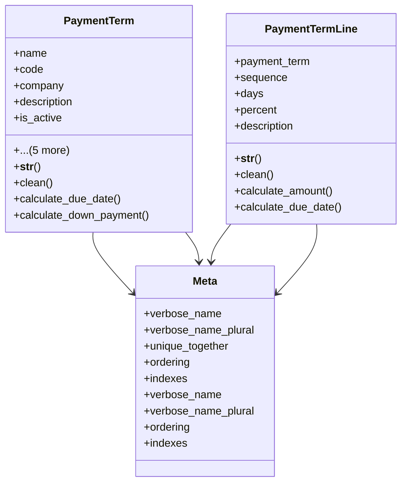

# business_modules.accounting.models.payment_term

## Imports
- core_modules.core.models
- datetime
- decimal
- django.core.exceptions
- django.core.validators
- django.db
- django.utils.translation

## Classes
- PaymentTerm
  - attr: `name`
  - attr: `code`
  - attr: `company`
  - attr: `description`
  - attr: `is_active`
  - attr: `due_type`
  - attr: `due_days`
  - attr: `due_day`
  - attr: `has_down_payment`
  - attr: `down_payment_percent`
  - method: `__str__`
  - method: `clean`
  - method: `calculate_due_date`
  - method: `calculate_down_payment`
- PaymentTermLine
  - attr: `payment_term`
  - attr: `sequence`
  - attr: `days`
  - attr: `percent`
  - attr: `description`
  - method: `__str__`
  - method: `clean`
  - method: `calculate_amount`
  - method: `calculate_due_date`
- Meta
  - attr: `verbose_name`
  - attr: `verbose_name_plural`
  - attr: `unique_together`
  - attr: `ordering`
  - attr: `indexes`
- Meta
  - attr: `verbose_name`
  - attr: `verbose_name_plural`
  - attr: `ordering`
  - attr: `indexes`

## Functions
- __str__
- clean
- calculate_due_date
- calculate_down_payment
- __str__
- clean
- calculate_amount
- calculate_due_date

## Class Diagram

