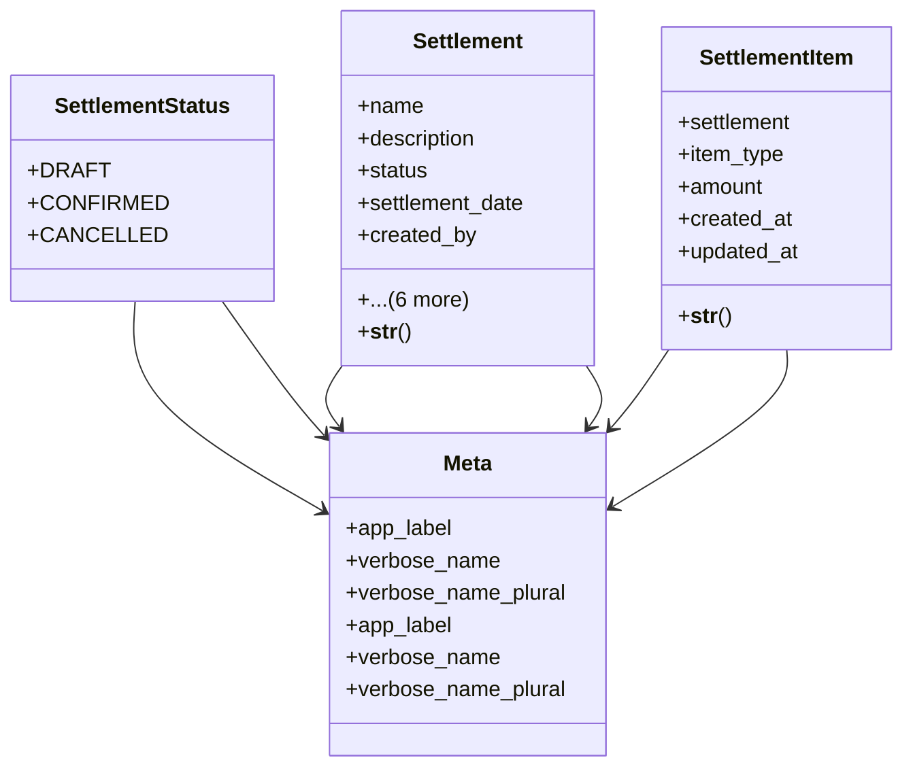

# business_modules.accounting.models.settlement

## Imports
- django.contrib.auth
- django.db
- django.utils.translation

## Classes
- SettlementStatus
  - attr: `DRAFT`
  - attr: `CONFIRMED`
  - attr: `CANCELLED`
- Settlement
  - attr: `name`
  - attr: `description`
  - attr: `status`
  - attr: `settlement_date`
  - attr: `created_by`
  - attr: `confirmed_by`
  - attr: `cancelled_by`
  - attr: `created_at`
  - attr: `updated_at`
  - attr: `confirmed_at`
  - attr: `cancelled_at`
  - method: `__str__`
- SettlementItem
  - attr: `settlement`
  - attr: `item_type`
  - attr: `amount`
  - attr: `created_at`
  - attr: `updated_at`
  - method: `__str__`
- Meta
  - attr: `app_label`
  - attr: `verbose_name`
  - attr: `verbose_name_plural`
- Meta
  - attr: `app_label`
  - attr: `verbose_name`
  - attr: `verbose_name_plural`

## Functions
- __str__
- __str__

## Module Variables
- `User`

## Class Diagram

