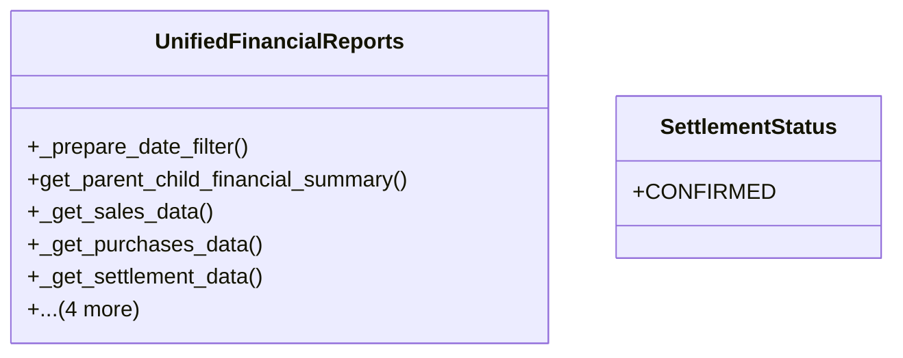

# business_modules.accounting.reports

## Imports
- __future__
- business_modules.accounting.models.settlement
- business_modules.contacts.models
- business_modules.purchasing.models
- business_modules.sales.models
- datetime
- decimal
- django.core.exceptions
- django.db
- django.db.models
- django.utils
- typing

## Classes
- UnifiedFinancialReports
  - method: `_prepare_date_filter`
  - method: `get_parent_child_financial_summary`
  - method: `_get_sales_data`
  - method: `_get_purchases_data`
  - method: `_get_settlement_data`
  - method: `_calculate_net_balance`
  - method: `get_settlement_opportunities_report`
  - method: `_serialize_invoices`
  - method: `get_settlement_history_report`
- SettlementStatus
  - attr: `CONFIRMED`

## Functions
- _prepare_date_filter
- get_parent_child_financial_summary
- _get_sales_data
- _get_purchases_data
- _get_settlement_data
- _calculate_net_balance
- get_settlement_opportunities_report
- _serialize_invoices
- get_settlement_history_report

## Class Diagram

