# business_modules.accounting.serializers

## Imports
- datetime
- decimal
- django.core.exceptions
- django.db
- django.db.models
- django.utils
- django.utils.translation
- models
- rest_framework
- services
- typing

## Classes
- AccountTypeSerializer
  - attr: `parent_name`
  - attr: `accounts_count`
  - method: `get_accounts_count`
  - method: `validate_code`
- AccountTypeDetailSerializer
  - attr: `children`
  - attr: `full_path`
  - method: `get_children`
  - method: `get_full_path`
- CurrencySerializer
  - method: `validate`
- AccountListSerializer
  - attr: `account_type_name`
  - attr: `parent_name`
  - attr: `currency_code`
  - attr: `balance`
  - method: `get_balance`
- AccountDetailSerializer
  - attr: `account_type_name`
  - attr: `parent_name`
  - attr: `company_name`
  - attr: `currency_info`
  - attr: `children`
  - attr: `balance_details`
  - attr: `full_path`
  - method: `get_currency_info`
  - method: `get_children`
  - method: `get_balance_details`
  - method: `get_full_path`
  - method: `validate`
- AccountSerializer
- AnalyticAccountSerializer
  - attr: `company_name`
  - attr: `parent_name`
- AnalyticAccountDetailSerializer
  - attr: `children`
  - attr: `full_path`
  - method: `get_children`
  - method: `get_full_path`
- JournalSerializer
  - attr: `company_name`
  - attr: `entries_count`
  - method: `get_entries_count`
- JournalEntryLineSerializer
  - attr: `account_name`
  - attr: `account_code`
  - attr: `analytic_account_name`
  - method: `validate`
- JournalEntryListSerializer
  - attr: `journal_name`
  - attr: `status_display`
  - attr: `is_balanced`
  - method: `get_is_balanced`
- JournalEntryDetailSerializer
  - attr: `journal_name`
  - attr: `company_name`
  - attr: `branch_name`
  - attr: `fiscal_period_name`
  - attr: `posted_by_name`
  - attr: `lines`
  - attr: `total_debit`
  - attr: `total_credit`
  - attr: `is_balanced`
  - method: `get_total_debit`
  - method: `get_total_credit`
  - method: `get_is_balanced`
- JournalEntryCreateSerializer
  - attr: `lines`
  - method: `validate`
  - method: `create`
  - method: `update`
- JournalEntrySerializer
- TaxSerializer
  - attr: `company_name`
  - attr: `account_name`
  - method: `validate_rate`
- FiscalYearSerializer
  - attr: `company_name`
  - attr: `periods_count`
  - method: `get_periods_count`
  - method: `validate`
- FiscalYearDetailSerializer
  - attr: `periods`
  - method: `get_periods`
- FiscalPeriodSerializer
  - attr: `fiscal_year_name`
  - attr: `entries_count`
  - method: `get_entries_count`
  - method: `validate`
- Meta
  - attr: `model`
  - attr: `fields`
  - attr: `read_only_fields`
- Meta
  - attr: `fields`
- Meta
  - attr: `model`
  - attr: `fields`
  - attr: `read_only_fields`
- Meta
  - attr: `model`
  - attr: `fields`
  - attr: `read_only_fields`
- Meta
  - attr: `model`
  - attr: `fields`
  - attr: `read_only_fields`
- Meta
  - attr: `model`
  - attr: `fields`
  - attr: `read_only_fields`
- Meta
  - attr: `fields`
- Meta
  - attr: `model`
  - attr: `fields`
  - attr: `read_only_fields`
- Meta
  - attr: `model`
  - attr: `fields`
  - attr: `read_only_fields`
- Meta
  - attr: `model`
  - attr: `fields`
  - attr: `read_only_fields`
- Meta
  - attr: `model`
  - attr: `fields`
  - attr: `read_only_fields`
- Meta
  - attr: `model`
  - attr: `fields`
- Meta
  - attr: `model`
  - attr: `fields`
  - attr: `read_only_fields`
- Meta
  - attr: `model`
  - attr: `fields`
  - attr: `read_only_fields`
- Meta
  - attr: `fields`
- Meta
  - attr: `model`
  - attr: `fields`
  - attr: `read_only_fields`

## Functions
- get_accounts_count
- validate_code
- get_children
- get_full_path
- validate
- get_balance
- get_currency_info
- get_children
- get_balance_details
- get_full_path
- validate
- get_children
- get_full_path
- get_entries_count
- validate
- get_is_balanced
- get_total_debit
- get_total_credit
- get_is_balanced
- validate
- create
- update
- validate_rate
- get_periods_count
- validate
- get_periods
- get_entries_count
- validate

## Class Diagram

```mermaid
classDiagram
    class AccountTypeSerializer {
        +parent_name
        +accounts_count
        +get_accounts_count()
        +validate_code()
    }
    class AccountTypeDetailSerializer {
        +children
        +full_path
        +get_children()
        +get_full_path()
    }
    class CurrencySerializer {
        +validate()
    }
    class AccountListSerializer {
        +account_type_name
        +parent_name
        +currency_code
        +balance
        +get_balance()
    }
    class AccountDetailSerializer {
        +account_type_name
        +parent_name
        +company_name
        +currency_info
        +children
        +... (2 more)
        +get_currency_info()
        +get_children()
        +get_balance_details()
        +get_full_path()
        +validate()
    }
    class AccountSerializer {
    }
    class AnalyticAccountSerializer {
        +company_name
        +parent_name
    }
    class AnalyticAccountDetailSerializer {
        +children
        +full_path
        +get_children()
        +get_full_path()
    }
    class JournalSerializer {
        +company_name
        +entries_count
        +get_entries_count()
    }
    class JournalEntryLineSerializer {
        +account_name
        +account_code
        +analytic_account_name
        +validate()
    }
    class JournalEntryListSerializer {
        +journal_name
        +status_display
        +is_balanced
        +get_is_balanced()
    }
    class JournalEntryDetailSerializer {
        +journal_name
        +company_name
        +branch_name
        +fiscal_period_name
        +posted_by_name
        +... (4 more)
        +get_total_debit()
        +get_total_credit()
        +get_is_balanced()
    }
    class JournalEntryCreateSerializer {
        +lines
        +validate()
        +create()
        +update()
    }
    class JournalEntrySerializer {
    }
    class TaxSerializer {
        +company_name
        +account_name
        +validate_rate()
    }
    class FiscalYearSerializer {
        +company_name
        +periods_count
        +get_periods_count()
        +validate()
    }
    class FiscalYearDetailSerializer {
        +periods
        +get_periods()
    }
    class FiscalPeriodSerializer {
        +fiscal_year_name
        +entries_count
        +get_entries_count()
        +validate()
    }
    class Meta {
        +model
        +fields
        +read_only_fields
    }
    class Meta {
        +fields
    }
    class Meta {
        +model
        +fields
        +read_only_fields
    }
    class Meta {
        +model
        +fields
        +read_only_fields
    }
    class Meta {
        +model
        +fields
        +read_only_fields
    }
    class Meta {
        +model
        +fields
        +read_only_fields
    }
    class Meta {
        +fields
    }
    class Meta {
        +model
        +fields
        +read_only_fields
    }
    class Meta {
        +model
        +fields
        +read_only_fields
    }
    class Meta {
        +model
        +fields
        +read_only_fields
    }
    class Meta {
        +model
        +fields
        +read_only_fields
    }
    class Meta {
        +model
        +fields
    }
    class Meta {
        +model
        +fields
        +read_only_fields
    }
    class Meta {
        +model
        +fields
        +read_only_fields
    }
    class Meta {
        +fields
    }
    class Meta {
        +model
        +fields
        +read_only_fields
    }
    AccountTypeSerializer --> Meta
    AccountTypeSerializer --> Meta
    AccountTypeSerializer --> Meta
    AccountTypeSerializer --> Meta
    AccountTypeSerializer --> Meta
    AccountTypeSerializer --> Meta
    AccountTypeSerializer --> Meta
    AccountTypeSerializer --> Meta
    AccountTypeSerializer --> Meta
    AccountTypeSerializer --> Meta
    AccountTypeSerializer --> Meta
    AccountTypeSerializer --> Meta
    AccountTypeSerializer --> Meta
    AccountTypeSerializer --> Meta
    AccountTypeSerializer --> Meta
    AccountTypeSerializer --> Meta
    AccountTypeDetailSerializer --> Meta
    AccountTypeDetailSerializer --> Meta
    AccountTypeDetailSerializer --> Meta
    AccountTypeDetailSerializer --> Meta
    AccountTypeDetailSerializer --> Meta
    AccountTypeDetailSerializer --> Meta
    AccountTypeDetailSerializer --> Meta
    AccountTypeDetailSerializer --> Meta
    AccountTypeDetailSerializer --> Meta
    AccountTypeDetailSerializer --> Meta
    AccountTypeDetailSerializer --> Meta
    AccountTypeDetailSerializer --> Meta
    AccountTypeDetailSerializer --> Meta
    AccountTypeDetailSerializer --> Meta
    AccountTypeDetailSerializer --> Meta
    AccountTypeDetailSerializer --> Meta
    CurrencySerializer --> Meta
    CurrencySerializer --> Meta
    CurrencySerializer --> Meta
    CurrencySerializer --> Meta
    CurrencySerializer --> Meta
    CurrencySerializer --> Meta
    CurrencySerializer --> Meta
    CurrencySerializer --> Meta
    CurrencySerializer --> Meta
    CurrencySerializer --> Meta
    CurrencySerializer --> Meta
    CurrencySerializer --> Meta
    CurrencySerializer --> Meta
    CurrencySerializer --> Meta
    CurrencySerializer --> Meta
    CurrencySerializer --> Meta
    AccountListSerializer --> Meta
    AccountListSerializer --> Meta
    AccountListSerializer --> Meta
    AccountListSerializer --> Meta
    AccountListSerializer --> Meta
    AccountListSerializer --> Meta
    AccountListSerializer --> Meta
    AccountListSerializer --> Meta
    AccountListSerializer --> Meta
    AccountListSerializer --> Meta
    AccountListSerializer --> Meta
    AccountListSerializer --> Meta
    AccountListSerializer --> Meta
    AccountListSerializer --> Meta
    AccountListSerializer --> Meta
    AccountListSerializer --> Meta
    AccountDetailSerializer --> Meta
    AccountDetailSerializer --> Meta
    AccountDetailSerializer --> Meta
    AccountDetailSerializer --> Meta
    AccountDetailSerializer --> Meta
    AccountDetailSerializer --> Meta
    AccountDetailSerializer --> Meta
    AccountDetailSerializer --> Meta
    AccountDetailSerializer --> Meta
    AccountDetailSerializer --> Meta
    AccountDetailSerializer --> Meta
    AccountDetailSerializer --> Meta
    AccountDetailSerializer --> Meta
    AccountDetailSerializer --> Meta
    AccountDetailSerializer --> Meta
    AccountDetailSerializer --> Meta
    AccountSerializer --> Meta
    AccountSerializer --> Meta
    AccountSerializer --> Meta
    AccountSerializer --> Meta
    AccountSerializer --> Meta
    AccountSerializer --> Meta
    AccountSerializer --> Meta
    AccountSerializer --> Meta
    AccountSerializer --> Meta
    AccountSerializer --> Meta
    AccountSerializer --> Meta
    AccountSerializer --> Meta
    AccountSerializer --> Meta
    AccountSerializer --> Meta
    AccountSerializer --> Meta
    AccountSerializer --> Meta
    AnalyticAccountSerializer --> Meta
    AnalyticAccountSerializer --> Meta
    AnalyticAccountSerializer --> Meta
    AnalyticAccountSerializer --> Meta
    AnalyticAccountSerializer --> Meta
    AnalyticAccountSerializer --> Meta
    AnalyticAccountSerializer --> Meta
    AnalyticAccountSerializer --> Meta
    AnalyticAccountSerializer --> Meta
    AnalyticAccountSerializer --> Meta
    AnalyticAccountSerializer --> Meta
    AnalyticAccountSerializer --> Meta
    AnalyticAccountSerializer --> Meta
    AnalyticAccountSerializer --> Meta
    AnalyticAccountSerializer --> Meta
    AnalyticAccountSerializer --> Meta
    AnalyticAccountDetailSerializer --> Meta
    AnalyticAccountDetailSerializer --> Meta
    AnalyticAccountDetailSerializer --> Meta
    AnalyticAccountDetailSerializer --> Meta
    AnalyticAccountDetailSerializer --> Meta
    AnalyticAccountDetailSerializer --> Meta
    AnalyticAccountDetailSerializer --> Meta
    AnalyticAccountDetailSerializer --> Meta
    AnalyticAccountDetailSerializer --> Meta
    AnalyticAccountDetailSerializer --> Meta
    AnalyticAccountDetailSerializer --> Meta
    AnalyticAccountDetailSerializer --> Meta
    AnalyticAccountDetailSerializer --> Meta
    AnalyticAccountDetailSerializer --> Meta
    AnalyticAccountDetailSerializer --> Meta
    AnalyticAccountDetailSerializer --> Meta
    JournalSerializer --> Meta
    JournalSerializer --> Meta
    JournalSerializer --> Meta
    JournalSerializer --> Meta
    JournalSerializer --> Meta
    JournalSerializer --> Meta
    JournalSerializer --> Meta
    JournalSerializer --> Meta
    JournalSerializer --> Meta
    JournalSerializer --> Meta
    JournalSerializer --> Meta
    JournalSerializer --> Meta
    JournalSerializer --> Meta
    JournalSerializer --> Meta
    JournalSerializer --> Meta
    JournalSerializer --> Meta
    JournalEntryLineSerializer --> Meta
    JournalEntryLineSerializer --> Meta
    JournalEntryLineSerializer --> Meta
    JournalEntryLineSerializer --> Meta
    JournalEntryLineSerializer --> Meta
    JournalEntryLineSerializer --> Meta
    JournalEntryLineSerializer --> Meta
    JournalEntryLineSerializer --> Meta
    JournalEntryLineSerializer --> Meta
    JournalEntryLineSerializer --> Meta
    JournalEntryLineSerializer --> Meta
    JournalEntryLineSerializer --> Meta
    JournalEntryLineSerializer --> Meta
    JournalEntryLineSerializer --> Meta
    JournalEntryLineSerializer --> Meta
    JournalEntryLineSerializer --> Meta
    JournalEntryListSerializer --> Meta
    JournalEntryListSerializer --> Meta
    JournalEntryListSerializer --> Meta
    JournalEntryListSerializer --> Meta
    JournalEntryListSerializer --> Meta
    JournalEntryListSerializer --> Meta
    JournalEntryListSerializer --> Meta
    JournalEntryListSerializer --> Meta
    JournalEntryListSerializer --> Meta
    JournalEntryListSerializer --> Meta
    JournalEntryListSerializer --> Meta
    JournalEntryListSerializer --> Meta
    JournalEntryListSerializer --> Meta
    JournalEntryListSerializer --> Meta
    JournalEntryListSerializer --> Meta
    JournalEntryListSerializer --> Meta
    JournalEntryDetailSerializer --> Meta
    JournalEntryDetailSerializer --> Meta
    JournalEntryDetailSerializer --> Meta
    JournalEntryDetailSerializer --> Meta
    JournalEntryDetailSerializer --> Meta
    JournalEntryDetailSerializer --> Meta
    JournalEntryDetailSerializer --> Meta
    JournalEntryDetailSerializer --> Meta
    JournalEntryDetailSerializer --> Meta
    JournalEntryDetailSerializer --> Meta
    JournalEntryDetailSerializer --> Meta
    JournalEntryDetailSerializer --> Meta
    JournalEntryDetailSerializer --> Meta
    JournalEntryDetailSerializer --> Meta
    JournalEntryDetailSerializer --> Meta
    JournalEntryDetailSerializer --> Meta
    JournalEntryCreateSerializer --> Meta
    JournalEntryCreateSerializer --> Meta
    JournalEntryCreateSerializer --> Meta
    JournalEntryCreateSerializer --> Meta
    JournalEntryCreateSerializer --> Meta
    JournalEntryCreateSerializer --> Meta
    JournalEntryCreateSerializer --> Meta
    JournalEntryCreateSerializer --> Meta
    JournalEntryCreateSerializer --> Meta
    JournalEntryCreateSerializer --> Meta
    JournalEntryCreateSerializer --> Meta
    JournalEntryCreateSerializer --> Meta
    JournalEntryCreateSerializer --> Meta
    JournalEntryCreateSerializer --> Meta
    JournalEntryCreateSerializer --> Meta
    JournalEntryCreateSerializer --> Meta
    JournalEntrySerializer --> Meta
    JournalEntrySerializer --> Meta
    JournalEntrySerializer --> Meta
    JournalEntrySerializer --> Meta
    JournalEntrySerializer --> Meta
    JournalEntrySerializer --> Meta
    JournalEntrySerializer --> Meta
    JournalEntrySerializer --> Meta
    JournalEntrySerializer --> Meta
    JournalEntrySerializer --> Meta
    JournalEntrySerializer --> Meta
    JournalEntrySerializer --> Meta
    JournalEntrySerializer --> Meta
    JournalEntrySerializer --> Meta
    JournalEntrySerializer --> Meta
    JournalEntrySerializer --> Meta
    TaxSerializer --> Meta
    TaxSerializer --> Meta
    TaxSerializer --> Meta
    TaxSerializer --> Meta
    TaxSerializer --> Meta
    TaxSerializer --> Meta
    TaxSerializer --> Meta
    TaxSerializer --> Meta
    TaxSerializer --> Meta
    TaxSerializer --> Meta
    TaxSerializer --> Meta
    TaxSerializer --> Meta
    TaxSerializer --> Meta
    TaxSerializer --> Meta
    TaxSerializer --> Meta
    TaxSerializer --> Meta
    FiscalYearSerializer --> Meta
    FiscalYearSerializer --> Meta
    FiscalYearSerializer --> Meta
    FiscalYearSerializer --> Meta
    FiscalYearSerializer --> Meta
    FiscalYearSerializer --> Meta
    FiscalYearSerializer --> Meta
    FiscalYearSerializer --> Meta
    FiscalYearSerializer --> Meta
    FiscalYearSerializer --> Meta
    FiscalYearSerializer --> Meta
    FiscalYearSerializer --> Meta
    FiscalYearSerializer --> Meta
    FiscalYearSerializer --> Meta
    FiscalYearSerializer --> Meta
    FiscalYearSerializer --> Meta
    FiscalYearDetailSerializer --> Meta
    FiscalYearDetailSerializer --> Meta
    FiscalYearDetailSerializer --> Meta
    FiscalYearDetailSerializer --> Meta
    FiscalYearDetailSerializer --> Meta
    FiscalYearDetailSerializer --> Meta
    FiscalYearDetailSerializer --> Meta
    FiscalYearDetailSerializer --> Meta
    FiscalYearDetailSerializer --> Meta
    FiscalYearDetailSerializer --> Meta
    FiscalYearDetailSerializer --> Meta
    FiscalYearDetailSerializer --> Meta
    FiscalYearDetailSerializer --> Meta
    FiscalYearDetailSerializer --> Meta
    FiscalYearDetailSerializer --> Meta
    FiscalYearDetailSerializer --> Meta
    FiscalPeriodSerializer --> Meta
    FiscalPeriodSerializer --> Meta
    FiscalPeriodSerializer --> Meta
    FiscalPeriodSerializer --> Meta
    FiscalPeriodSerializer --> Meta
    FiscalPeriodSerializer --> Meta
    FiscalPeriodSerializer --> Meta
    FiscalPeriodSerializer --> Meta
    FiscalPeriodSerializer --> Meta
    FiscalPeriodSerializer --> Meta
    FiscalPeriodSerializer --> Meta
    FiscalPeriodSerializer --> Meta
    FiscalPeriodSerializer --> Meta
    FiscalPeriodSerializer --> Meta
    FiscalPeriodSerializer --> Meta
    FiscalPeriodSerializer --> Meta
```

