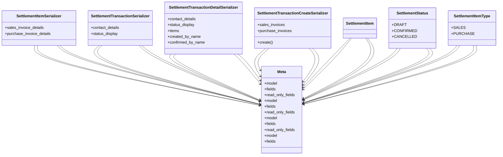

# business_modules.accounting.serializers.settlement_serializers

## Imports
- business_modules.accounting.models.settlement
- business_modules.accounting.serializers.invoice_serializers
- business_modules.accounting.services.settlement_service
- business_modules.contacts.serializers
- business_modules.purchasing.models
- business_modules.sales.models
- rest_framework

## Classes
- SettlementItemSerializer
  - attr: `sales_invoice_details`
  - attr: `purchase_invoice_details`
- SettlementTransactionSerializer
  - attr: `contact_details`
  - attr: `status_display`
- SettlementTransactionDetailSerializer
  - attr: `contact_details`
  - attr: `status_display`
  - attr: `items`
  - attr: `created_by_name`
  - attr: `confirmed_by_name`
- SettlementTransactionCreateSerializer
  - attr: `sales_invoices`
  - attr: `purchase_invoices`
  - method: `create`
- Meta
  - attr: `model`
  - attr: `fields`
  - attr: `read_only_fields`
- Meta
  - attr: `model`
  - attr: `fields`
  - attr: `read_only_fields`
- Meta
  - attr: `model`
  - attr: `fields`
  - attr: `read_only_fields`
- Meta
  - attr: `model`
  - attr: `fields`
- SettlementItem
- SettlementStatus
  - attr: `DRAFT`
  - attr: `CONFIRMED`
  - attr: `CANCELLED`
- SettlementItemType
  - attr: `SALES`
  - attr: `PURCHASE`

## Functions
- create

## Class Diagram

