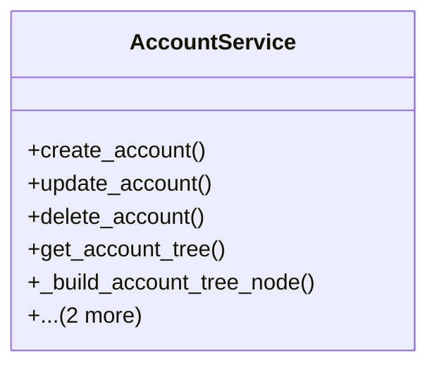

# business_modules.accounting.services.account_service

## Imports
- datetime
- django.core.exceptions
- django.db
- django.db.models
- django.utils.translation
- models

## Classes
- AccountService
  - method: `create_account`
  - method: `update_account`
  - method: `delete_account`
  - method: `get_account_tree`
  - method: `_build_account_tree_node`
  - method: `get_account_balance_sheet`
  - method: `get_account_income_statement`

## Functions
- create_account
- update_account
- delete_account
- get_account_tree
- _build_account_tree_node
- get_account_balance_sheet
- get_account_income_statement

## Class Diagram

