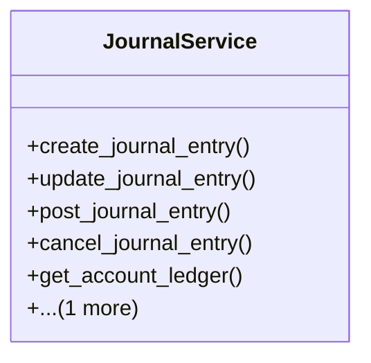

# business_modules.accounting.services.journal_service

## Imports
- django.core.exceptions
- django.db
- django.utils
- django.utils.translation
- models

## Classes
- JournalService
  - method: `create_journal_entry`
  - method: `update_journal_entry`
  - method: `post_journal_entry`
  - method: `cancel_journal_entry`
  - method: `get_account_ledger`
  - method: `get_journal_entries`

## Functions
- create_journal_entry
- update_journal_entry
- post_journal_entry
- cancel_journal_entry
- get_account_ledger
- get_journal_entries

## Class Diagram

