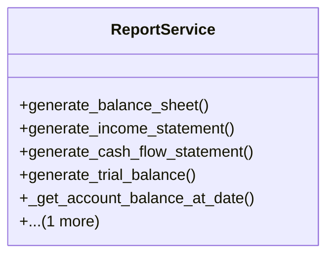

# business_modules.accounting.services.report_service

## Imports
- datetime
- django.db.models
- django.utils.translation
- models

## Classes
- ReportService
  - method: `generate_balance_sheet`
  - method: `generate_income_statement`
  - method: `generate_cash_flow_statement`
  - method: `generate_trial_balance`
  - method: `_get_account_balance_at_date`
  - method: `_get_account_balance_for_period`

## Functions
- generate_balance_sheet
- generate_income_statement
- generate_cash_flow_statement
- generate_trial_balance
- _get_account_balance_at_date
- _get_account_balance_for_period

## Class Diagram

