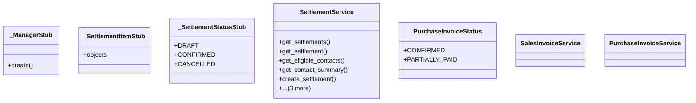

# business_modules.accounting.services.settlement_service

## Imports
- business_modules.accounting.models.settlement
- business_modules.contacts.models
- business_modules.purchasing.models
- business_modules.purchasing.services
- business_modules.sales.models
- business_modules.sales.models.stub_minimal
- business_modules.sales.services
- django.db
- django.db.models
- django.utils
- typing

## Classes
- _ManagerStub
  - method: `create`
- _SettlementItemStub
  - attr: `objects`
- _SettlementStatusStub
  - attr: `DRAFT`
  - attr: `CONFIRMED`
  - attr: `CANCELLED`
- SettlementService
  - method: `get_settlements`
  - method: `get_settlement`
  - method: `get_eligible_contacts`
  - method: `get_contact_summary`
  - method: `create_settlement`
  - method: `confirm_settlement`
  - method: `cancel_settlement`
  - method: `get_settlement_report`
- PurchaseInvoiceStatus
  - attr: `CONFIRMED`
  - attr: `PARTIALLY_PAID`
- SalesInvoiceService
- PurchaseInvoiceService

## Functions
- create
- get_settlements
- get_settlement
- get_eligible_contacts
- get_contact_summary
- create_settlement
- confirm_settlement
- cancel_settlement
- get_settlement_report

## Module Variables
- `Settlement`
- `SettlementItem`
- `SettlementStatus`

## Class Diagram

