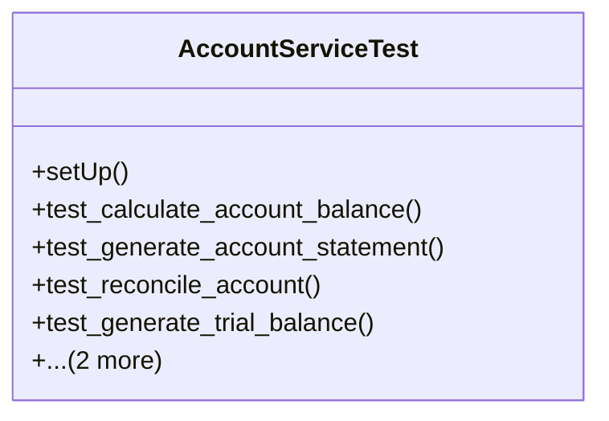

# business_modules.accounting.tests.test_account_service

## Imports
- core_modules.core.models
- datetime
- decimal
- django.test
- django.utils
- models.account
- models.journal
- services.account_service

## Classes
- AccountServiceTest
  - method: `setUp`
  - method: `test_calculate_account_balance`
  - method: `test_generate_account_statement`
  - method: `test_reconcile_account`
  - method: `test_generate_trial_balance`
  - method: `test_generate_balance_sheet`
  - method: `test_generate_income_statement`

## Functions
- setUp
- test_calculate_account_balance
- test_generate_account_statement
- test_reconcile_account
- test_generate_trial_balance
- test_generate_balance_sheet
- test_generate_income_statement

## Class Diagram

