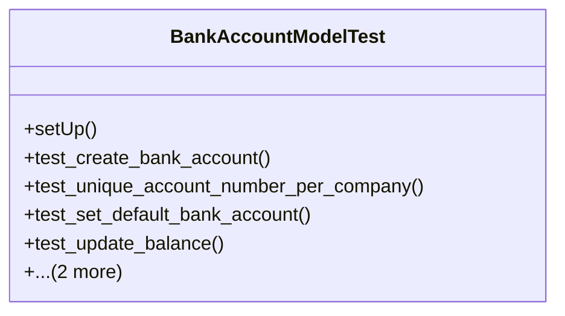

# business_modules.accounting.tests.test_bank_account

## Imports
- core_modules.core.models
- decimal
- django.core.exceptions
- django.db
- django.test
- django.utils
- models.account
- models.bank_account

## Classes
- BankAccountModelTest
  - method: `setUp`
  - method: `test_create_bank_account`
  - method: `test_unique_account_number_per_company`
  - method: `test_set_default_bank_account`
  - method: `test_update_balance`
  - method: `test_bank_transaction`
  - method: `test_bank_reconciliation`

## Functions
- setUp
- test_create_bank_account
- test_unique_account_number_per_company
- test_set_default_bank_account
- test_update_balance
- test_bank_transaction
- test_bank_reconciliation

## Class Diagram

