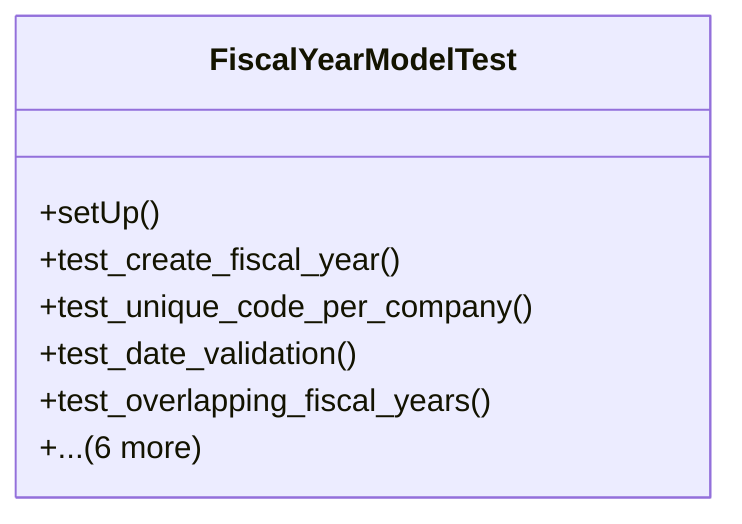

# business_modules.accounting.tests.test_fiscal_year

## Imports
- core_modules.core.models
- datetime
- django.core.exceptions
- django.db
- django.test
- django.utils
- models.fiscal_year

## Classes
- FiscalYearModelTest
  - method: `setUp`
  - method: `test_create_fiscal_year`
  - method: `test_unique_code_per_company`
  - method: `test_date_validation`
  - method: `test_overlapping_fiscal_years`
  - method: `test_close_fiscal_year`
  - method: `test_get_current_fiscal_year`
  - method: `test_create_fiscal_periods`
  - method: `test_close_fiscal_period`
  - method: `test_get_period_for_date`
  - method: `test_validate_fiscal_period`

## Functions
- setUp
- test_create_fiscal_year
- test_unique_code_per_company
- test_date_validation
- test_overlapping_fiscal_years
- test_close_fiscal_year
- test_get_current_fiscal_year
- test_create_fiscal_periods
- test_close_fiscal_period
- test_get_period_for_date
- test_validate_fiscal_period

## Class Diagram

