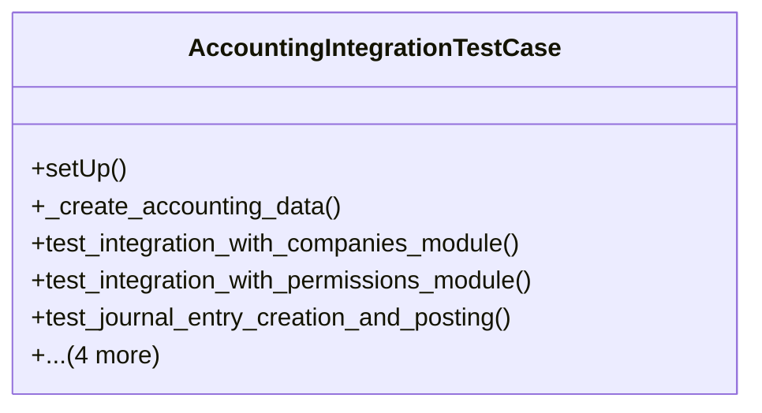

# business_modules.accounting.tests.test_integration

## Imports
- core_modules.companies.models
- core_modules.permissions.models
- django.contrib.auth
- django.test
- django.urls
- models
- rest_framework
- rest_framework.test

## Classes
- AccountingIntegrationTestCase
  - method: `setUp`
  - method: `_create_accounting_data`
  - method: `test_integration_with_companies_module`
  - method: `test_integration_with_permissions_module`
  - method: `test_journal_entry_creation_and_posting`
  - method: `test_account_balance_calculation`
  - method: `test_partner_balance_calculation`
  - method: `test_fiscal_year_and_period_management`
  - method: `test_tax_calculation`

## Functions
- setUp
- _create_accounting_data
- test_integration_with_companies_module
- test_integration_with_permissions_module
- test_journal_entry_creation_and_posting
- test_account_balance_calculation
- test_partner_balance_calculation
- test_fiscal_year_and_period_management
- test_tax_calculation

## Module Variables
- `User`

## Class Diagram

