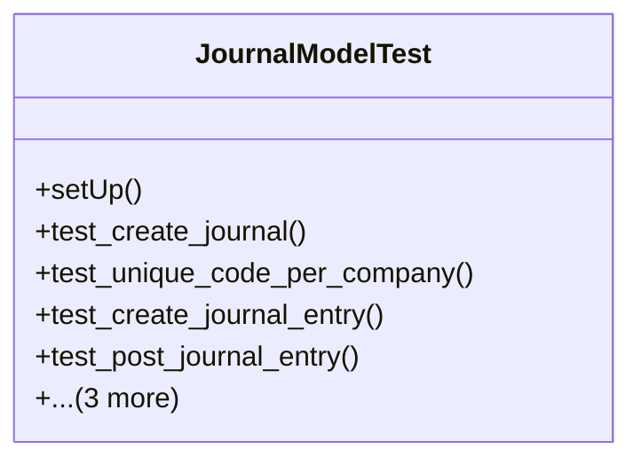

# business_modules.accounting.tests.test_journal

## Imports
- core_modules.core.models
- decimal
- django.core.exceptions
- django.db
- django.test
- django.utils
- models.account
- models.journal

## Classes
- JournalModelTest
  - method: `setUp`
  - method: `test_create_journal`
  - method: `test_unique_code_per_company`
  - method: `test_create_journal_entry`
  - method: `test_post_journal_entry`
  - method: `test_unbalanced_entry`
  - method: `test_reverse_journal_entry`
  - method: `test_copy_journal_entry`

## Functions
- setUp
- test_create_journal
- test_unique_code_per_company
- test_create_journal_entry
- test_post_journal_entry
- test_unbalanced_entry
- test_reverse_journal_entry
- test_copy_journal_entry

## Class Diagram

