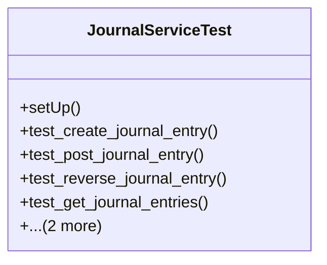

# business_modules.accounting.tests.test_journal_service

## Imports
- core_modules.core.models
- datetime
- decimal
- django.test
- django.utils
- models.account
- models.journal
- services.journal_service

## Classes
- JournalServiceTest
  - method: `setUp`
  - method: `test_create_journal_entry`
  - method: `test_post_journal_entry`
  - method: `test_reverse_journal_entry`
  - method: `test_get_journal_entries`
  - method: `test_generate_journal_report`
  - method: `test_validate_journal_entry`

## Functions
- setUp
- test_create_journal_entry
- test_post_journal_entry
- test_reverse_journal_entry
- test_get_journal_entries
- test_generate_journal_report
- test_validate_journal_entry

## Class Diagram

