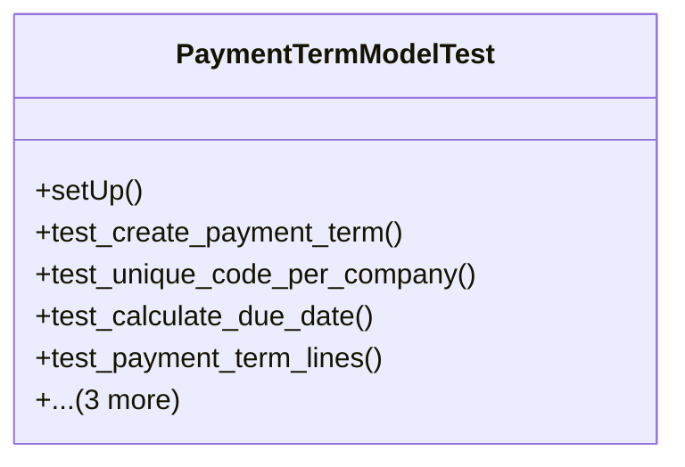

# business_modules.accounting.tests.test_payment_term

## Imports
- core_modules.core.models
- datetime
- decimal
- django.core.exceptions
- django.db
- django.test
- django.utils
- models.payment_term

## Classes
- PaymentTermModelTest
  - method: `setUp`
  - method: `test_create_payment_term`
  - method: `test_unique_code_per_company`
  - method: `test_calculate_due_date`
  - method: `test_payment_term_lines`
  - method: `test_calculate_payment_schedule`
  - method: `test_calculate_down_payment`
  - method: `test_get_term_lines`

## Functions
- setUp
- test_create_payment_term
- test_unique_code_per_company
- test_calculate_due_date
- test_payment_term_lines
- test_calculate_payment_schedule
- test_calculate_down_payment
- test_get_term_lines

## Class Diagram

