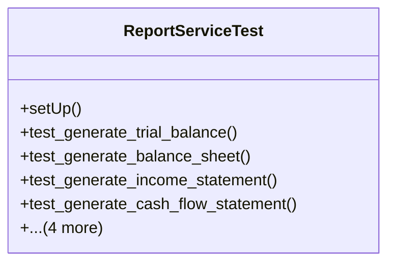

# business_modules.accounting.tests.test_report_service

## Imports
- core_modules.core.models
- datetime
- decimal
- django.db
- django.test
- django.utils
- models.account
- models.journal
- services.report_service

## Classes
- ReportServiceTest
  - method: `setUp`
  - method: `test_generate_trial_balance`
  - method: `test_generate_balance_sheet`
  - method: `test_generate_income_statement`
  - method: `test_generate_cash_flow_statement`
  - method: `test_generate_accounts_receivable_aging`
  - method: `test_generate_accounts_payable_aging`
  - method: `test_generate_general_ledger`
  - method: `test_generate_partner_statement`

## Functions
- setUp
- test_generate_trial_balance
- test_generate_balance_sheet
- test_generate_income_statement
- test_generate_cash_flow_statement
- test_generate_accounts_receivable_aging
- test_generate_accounts_payable_aging
- test_generate_general_ledger
- test_generate_partner_statement

## Class Diagram

