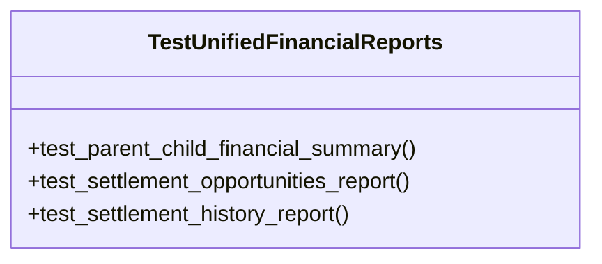

# business_modules.accounting.tests.test_reports

## Imports
- business_modules.accounting.models.settlement
- business_modules.accounting.reports
- business_modules.contacts.models
- business_modules.purchasing.models
- business_modules.sales.models
- datetime
- decimal
- django.contrib.auth
- django.utils
- pytest

## Classes
- TestUnifiedFinancialReports
  - method: `test_parent_child_financial_summary`
  - method: `test_settlement_opportunities_report`
  - method: `test_settlement_history_report`

## Functions
- test_user
- parent_contact
- child_contact_1
- child_contact_2
- child_contact_3
- setup_invoices
- test_parent_child_financial_summary
- test_settlement_opportunities_report
- test_settlement_history_report

## Module Variables
- `User`

## Class Diagram

