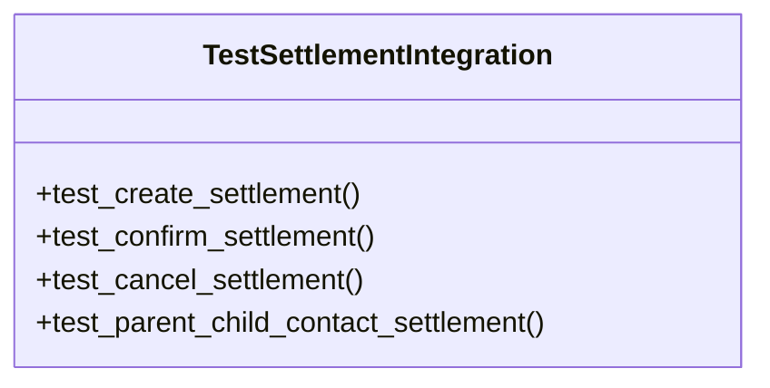

# business_modules.accounting.tests.test_settlement_integration

## Imports
- business_modules.accounting.models.settlement
- business_modules.accounting.services.settlement_service
- business_modules.accounting.views.integration_api
- business_modules.contacts.models
- business_modules.contacts.services
- business_modules.purchasing.models
- business_modules.sales.models
- decimal
- django.contrib.auth
- django.utils
- pytest

## Classes
- TestSettlementIntegration
  - method: `test_create_settlement`
  - method: `test_confirm_settlement`
  - method: `test_cancel_settlement`
  - method: `test_parent_child_contact_settlement`

## Functions
- test_user
- dual_contact
- parent_contact
- child_contact
- sales_invoice
- purchase_invoice
- test_create_settlement
- test_confirm_settlement
- test_cancel_settlement
- test_parent_child_contact_settlement

## Module Variables
- `User`

## Class Diagram

