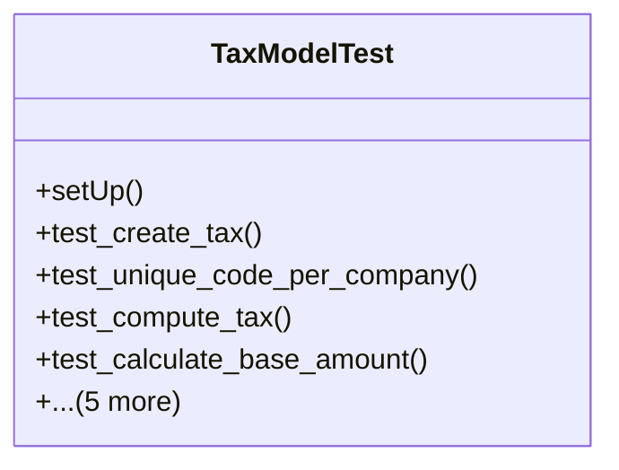

# business_modules.accounting.tests.test_tax

## Imports
- core_modules.core.models
- decimal
- django.core.exceptions
- django.db
- django.test
- models.tax

## Classes
- TaxModelTest
  - method: `setUp`
  - method: `test_create_tax`
  - method: `test_unique_code_per_company`
  - method: `test_compute_tax`
  - method: `test_calculate_base_amount`
  - method: `test_tax_group`
  - method: `test_compute_taxes`
  - method: `test_compute_total_taxes`
  - method: `test_compute_total_amount`
  - method: `test_create_tax_group`

## Functions
- setUp
- test_create_tax
- test_unique_code_per_company
- test_compute_tax
- test_calculate_base_amount
- test_tax_group
- test_compute_taxes
- test_compute_total_taxes
- test_compute_total_amount
- test_create_tax_group

## Class Diagram

