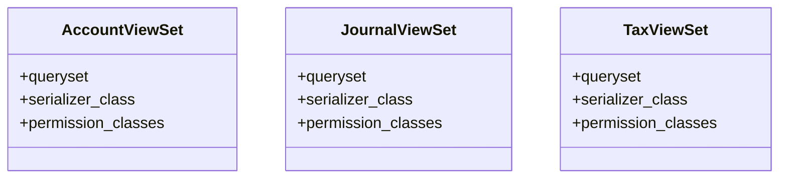

# business_modules.accounting.views

## Imports
- models
- rest_framework
- rest_framework.decorators
- rest_framework.permissions
- rest_framework.response
- serializers

## Classes
- AccountViewSet
  - attr: `queryset`
  - attr: `serializer_class`
  - attr: `permission_classes`
- JournalViewSet
  - attr: `queryset`
  - attr: `serializer_class`
  - attr: `permission_classes`
- TaxViewSet
  - attr: `queryset`
  - attr: `serializer_class`
  - attr: `permission_classes`

## Functions
- reports_view
- dashboard_view

## Class Diagram

