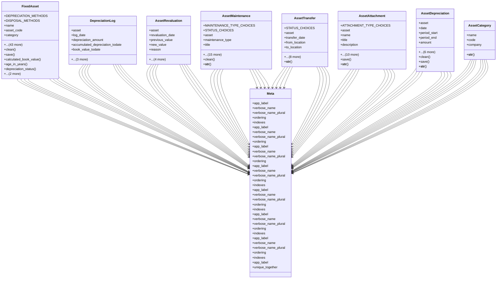

# business_modules.assets.models

## Imports
- decimal
- django.conf
- django.core.exceptions
- django.core.validators
- django.db
- django.utils
- django.utils.translation
- services_modules.assets.models.asset_category

## Classes
- FixedAsset
  - attr: `DEPRECIATION_METHODS`
  - attr: `DISPOSAL_METHODS`
  - attr: `name`
  - attr: `asset_code`
  - attr: `category`
  - attr: `description`
  - attr: `serial_number`
  - attr: `barcode`
  - attr: `qr_code`
  - attr: `company`
  - attr: `branch`
  - attr: `department`
  - attr: `currency`
  - attr: `purchase_date`
  - attr: `purchase_cost`
  - attr: `supplier`
  - attr: `purchase_order`
  - attr: `purchase_invoice`
  - attr: `warranty_start_date`
  - attr: `warranty_end_date`
  - attr: `location`
  - attr: `responsible_person`
  - attr: `project`
  - attr: `is_wip`
  - attr: `capitalization_date`
  - attr: `parent_wip_asset`
  - attr: `useful_life_years`
  - attr: `salvage_value`
  - attr: `depreciation_method`
  - attr: `depreciation_start_date`
  - attr: `accumulated_depreciation`
  - attr: `current_book_value`
  - attr: `last_depreciation_date`
  - attr: `asset_account`
  - attr: `accumulated_depreciation_account`
  - attr: `depreciation_expense_account`
  - attr: `current_market_value`
  - attr: `market_value_update_date`
  - attr: `is_disposed`
  - attr: `disposal_date`
  - attr: `disposal_method`
  - attr: `disposal_sale_price`
  - attr: `disposal_notes`
  - attr: `gain_loss_on_disposal`
  - attr: `created_at`
  - attr: `updated_at`
  - attr: `created_by`
  - attr: `updated_by`
  - method: `clean`
  - method: `save`
  - method: `calculated_book_value`
  - method: `age_in_years`
  - method: `depreciation_status`
  - method: `depreciation_percentage`
  - method: `__str__`
- DepreciationLog
  - attr: `asset`
  - attr: `log_date`
  - attr: `depreciation_amount`
  - attr: `accumulated_depreciation_todate`
  - attr: `book_value_todate`
  - attr: `journal_entry`
  - attr: `created_at`
  - attr: `created_by`
- AssetRevaluation
  - attr: `asset`
  - attr: `revaluation_date`
  - attr: `previous_value`
  - attr: `new_value`
  - attr: `reason`
  - attr: `journal_entry`
  - attr: `notes`
  - attr: `created_at`
  - attr: `created_by`
- AssetMaintenance
  - attr: `MAINTENANCE_TYPE_CHOICES`
  - attr: `STATUS_CHOICES`
  - attr: `asset`
  - attr: `maintenance_type`
  - attr: `title`
  - attr: `description`
  - attr: `scheduled_date`
  - attr: `start_date`
  - attr: `end_date`
  - attr: `status`
  - attr: `cost`
  - attr: `vendor`
  - attr: `maintenance_date`
  - attr: `performed_by`
  - attr: `next_due_date`
  - attr: `notes`
  - attr: `created_at`
  - attr: `updated_at`
  - attr: `created_by`
  - attr: `updated_by`
  - method: `clean`
  - method: `__str__`
- AssetTransfer
  - attr: `STATUS_CHOICES`
  - attr: `asset`
  - attr: `transfer_date`
  - attr: `from_location`
  - attr: `to_location`
  - attr: `from_department`
  - attr: `to_department`
  - attr: `from_responsible`
  - attr: `to_responsible`
  - attr: `reason`
  - attr: `notes`
  - attr: `created_at`
  - attr: `created_by`
  - method: `__str__`
- AssetAttachment
  - attr: `ATTACHMENT_TYPE_CHOICES`
  - attr: `asset`
  - attr: `name`
  - attr: `title`
  - attr: `description`
  - attr: `attachment_type`
  - attr: `file`
  - attr: `file_name`
  - attr: `file_size`
  - attr: `file_type`
  - attr: `is_public`
  - attr: `created_at`
  - attr: `updated_at`
  - attr: `created_by`
  - attr: `updated_by`
  - method: `save`
  - method: `__str__`
- AssetDepreciation
  - attr: `asset`
  - attr: `date`
  - attr: `period_start`
  - attr: `period_end`
  - attr: `amount`
  - attr: `accumulated_depreciation`
  - attr: `book_value_after`
  - attr: `journal_entry`
  - attr: `notes`
  - attr: `created_at`
  - attr: `created_by`
  - method: `clean`
  - method: `save`
  - method: `__str__`
- Meta
  - attr: `app_label`
  - attr: `verbose_name`
  - attr: `verbose_name_plural`
  - attr: `ordering`
  - attr: `indexes`
- Meta
  - attr: `app_label`
  - attr: `verbose_name`
  - attr: `verbose_name_plural`
  - attr: `ordering`
- Meta
  - attr: `app_label`
  - attr: `verbose_name`
  - attr: `verbose_name_plural`
  - attr: `ordering`
- Meta
  - attr: `app_label`
  - attr: `verbose_name`
  - attr: `verbose_name_plural`
  - attr: `ordering`
  - attr: `indexes`
- Meta
  - attr: `app_label`
  - attr: `verbose_name`
  - attr: `verbose_name_plural`
  - attr: `ordering`
  - attr: `indexes`
- Meta
  - attr: `app_label`
  - attr: `verbose_name`
  - attr: `verbose_name_plural`
  - attr: `ordering`
  - attr: `indexes`
- Meta
  - attr: `app_label`
  - attr: `verbose_name`
  - attr: `verbose_name_plural`
  - attr: `ordering`
  - attr: `indexes`
- AssetCategory
  - attr: `name`
  - attr: `code`
  - attr: `company`
  - method: `__str__`
- Meta
  - attr: `app_label`
  - attr: `unique_together`

## Functions
- clean
- save
- calculated_book_value
- age_in_years
- depreciation_status
- depreciation_percentage
- __str__
- clean
- __str__
- __str__
- save
- __str__
- clean
- save
- __str__
- __str__

## Class Diagram

