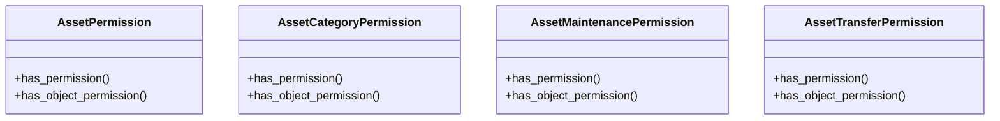

# business_modules.assets.permissions

## Imports
- rest_framework

## Classes
- AssetPermission
  - method: `has_permission`
  - method: `has_object_permission`
- AssetCategoryPermission
  - method: `has_permission`
  - method: `has_object_permission`
- AssetMaintenancePermission
  - method: `has_permission`
  - method: `has_object_permission`
- AssetTransferPermission
  - method: `has_permission`
  - method: `has_object_permission`

## Functions
- has_permission
- has_object_permission
- has_permission
- has_object_permission
- has_permission
- has_object_permission
- has_permission
- has_object_permission

## Class Diagram

