# business_modules.assets.serializers

## Imports
- models
- rest_framework

## Classes
- AccountSerializer
  - attr: `id`
  - attr: `name`
  - attr: `code`
- UserSerializer
  - attr: `id`
  - attr: `username`
  - attr: `full_name`
- CompanySerializer
  - attr: `id`
  - attr: `name`
- BranchSerializer
  - attr: `id`
  - attr: `name`
- DepartmentSerializer
  - attr: `id`
  - attr: `name`
- ContactSerializer
  - attr: `id`
  - attr: `name`
- CurrencySerializer
  - attr: `id`
  - attr: `name`
  - attr: `code`
- ProjectSerializer
  - attr: `id`
  - attr: `name`
- AssetCategorySerializer
  - attr: `company_details`
  - attr: `default_asset_account_details`
  - attr: `default_accumulated_depreciation_account_details`
  - attr: `default_depreciation_expense_account_details`
- FixedAssetSerializer
  - attr: `category_details`
  - attr: `company_details`
  - attr: `branch_details`
  - attr: `department_details`
  - attr: `currency_details`
  - attr: `supplier_details`
  - attr: `project_details`
  - attr: `asset_account_details`
  - attr: `accumulated_depreciation_account_details`
  - attr: `depreciation_expense_account_details`
  - attr: `responsible_person_details`
  - attr: `created_by_details`
  - attr: `updated_by_details`
  - attr: `age_in_years`
  - attr: `depreciation_status`
  - attr: `depreciation_percentage`
- DepreciationLogSerializer
  - attr: `asset_details`
  - attr: `created_by_details`
- AssetTransferSerializer
  - attr: `asset_details`
  - attr: `from_department_details`
  - attr: `to_department_details`
  - attr: `from_responsible_details`
  - attr: `to_responsible_details`
  - attr: `created_by_details`
- AssetMaintenanceSerializer
  - attr: `asset_details`
  - attr: `created_by_details`
  - attr: `maintenance_type_display`
- AssetAttachmentSerializer
  - attr: `asset_details`
  - attr: `created_by_details`
  - attr: `attachment_type_display`
  - attr: `file_url`
  - method: `get_file_url`
- AssetRevaluationSerializer
  - attr: `asset_details`
  - attr: `created_by_details`
  - attr: `value_change`
  - method: `get_value_change`
- Meta
  - attr: `model`
  - attr: `fields`
  - attr: `read_only_fields`
  - attr: `extra_kwargs`
- Meta
  - attr: `model`
  - attr: `fields`
  - attr: `read_only_fields`
  - attr: `extra_kwargs`
- Meta
  - attr: `model`
  - attr: `fields`
  - attr: `read_only_fields`
  - attr: `extra_kwargs`
- Meta
  - attr: `model`
  - attr: `fields`
  - attr: `read_only_fields`
  - attr: `extra_kwargs`
- Meta
  - attr: `model`
  - attr: `fields`
  - attr: `read_only_fields`
  - attr: `extra_kwargs`
- Meta
  - attr: `model`
  - attr: `fields`
  - attr: `read_only_fields`
  - attr: `extra_kwargs`
- Meta
  - attr: `model`
  - attr: `fields`
  - attr: `read_only_fields`
  - attr: `extra_kwargs`

## Functions
- get_file_url
- get_value_change

## Class Diagram

```mermaid
classDiagram
    class AccountSerializer {
        +id
        +name
        +code
    }
    class UserSerializer {
        +id
        +username
        +full_name
    }
    class CompanySerializer {
        +id
        +name
    }
    class BranchSerializer {
        +id
        +name
    }
    class DepartmentSerializer {
        +id
        +name
    }
    class ContactSerializer {
        +id
        +name
    }
    class CurrencySerializer {
        +id
        +name
        +code
    }
    class ProjectSerializer {
        +id
        +name
    }
    class AssetCategorySerializer {
        +company_details
        +default_asset_account_details
        +default_accumulated_depreciation_account_details
        +default_depreciation_expense_account_details
    }
    class FixedAssetSerializer {
        +category_details
        +company_details
        +branch_details
        +department_details
        +currency_details
        +... (11 more)
    }
    class DepreciationLogSerializer {
        +asset_details
        +created_by_details
    }
    class AssetTransferSerializer {
        +asset_details
        +from_department_details
        +to_department_details
        +from_responsible_details
        +to_responsible_details
        +... (1 more)
    }
    class AssetMaintenanceSerializer {
        +asset_details
        +created_by_details
        +maintenance_type_display
    }
    class AssetAttachmentSerializer {
        +asset_details
        +created_by_details
        +attachment_type_display
        +file_url
        +get_file_url()
    }
    class AssetRevaluationSerializer {
        +asset_details
        +created_by_details
        +value_change
        +get_value_change()
    }
    class Meta {
        +model
        +fields
        +read_only_fields
        +extra_kwargs
    }
    class Meta {
        +model
        +fields
        +read_only_fields
        +extra_kwargs
    }
    class Meta {
        +model
        +fields
        +read_only_fields
        +extra_kwargs
    }
    class Meta {
        +model
        +fields
        +read_only_fields
        +extra_kwargs
    }
    class Meta {
        +model
        +fields
        +read_only_fields
        +extra_kwargs
    }
    class Meta {
        +model
        +fields
        +read_only_fields
        +extra_kwargs
    }
    class Meta {
        +model
        +fields
        +read_only_fields
        +extra_kwargs
    }
    AccountSerializer --> Meta
    AccountSerializer --> Meta
    AccountSerializer --> Meta
    AccountSerializer --> Meta
    AccountSerializer --> Meta
    AccountSerializer --> Meta
    AccountSerializer --> Meta
    UserSerializer --> Meta
    UserSerializer --> Meta
    UserSerializer --> Meta
    UserSerializer --> Meta
    UserSerializer --> Meta
    UserSerializer --> Meta
    UserSerializer --> Meta
    CompanySerializer --> Meta
    CompanySerializer --> Meta
    CompanySerializer --> Meta
    CompanySerializer --> Meta
    CompanySerializer --> Meta
    CompanySerializer --> Meta
    CompanySerializer --> Meta
    BranchSerializer --> Meta
    BranchSerializer --> Meta
    BranchSerializer --> Meta
    BranchSerializer --> Meta
    BranchSerializer --> Meta
    BranchSerializer --> Meta
    BranchSerializer --> Meta
    DepartmentSerializer --> Meta
    DepartmentSerializer --> Meta
    DepartmentSerializer --> Meta
    DepartmentSerializer --> Meta
    DepartmentSerializer --> Meta
    DepartmentSerializer --> Meta
    DepartmentSerializer --> Meta
    ContactSerializer --> Meta
    ContactSerializer --> Meta
    ContactSerializer --> Meta
    ContactSerializer --> Meta
    ContactSerializer --> Meta
    ContactSerializer --> Meta
    ContactSerializer --> Meta
    CurrencySerializer --> Meta
    CurrencySerializer --> Meta
    CurrencySerializer --> Meta
    CurrencySerializer --> Meta
    CurrencySerializer --> Meta
    CurrencySerializer --> Meta
    CurrencySerializer --> Meta
    ProjectSerializer --> Meta
    ProjectSerializer --> Meta
    ProjectSerializer --> Meta
    ProjectSerializer --> Meta
    ProjectSerializer --> Meta
    ProjectSerializer --> Meta
    ProjectSerializer --> Meta
    AssetCategorySerializer --> Meta
    AssetCategorySerializer --> Meta
    AssetCategorySerializer --> Meta
    AssetCategorySerializer --> Meta
    AssetCategorySerializer --> Meta
    AssetCategorySerializer --> Meta
    AssetCategorySerializer --> Meta
    FixedAssetSerializer --> Meta
    FixedAssetSerializer --> Meta
    FixedAssetSerializer --> Meta
    FixedAssetSerializer --> Meta
    FixedAssetSerializer --> Meta
    FixedAssetSerializer --> Meta
    FixedAssetSerializer --> Meta
    DepreciationLogSerializer --> Meta
    DepreciationLogSerializer --> Meta
    DepreciationLogSerializer --> Meta
    DepreciationLogSerializer --> Meta
    DepreciationLogSerializer --> Meta
    DepreciationLogSerializer --> Meta
    DepreciationLogSerializer --> Meta
    AssetTransferSerializer --> Meta
    AssetTransferSerializer --> Meta
    AssetTransferSerializer --> Meta
    AssetTransferSerializer --> Meta
    AssetTransferSerializer --> Meta
    AssetTransferSerializer --> Meta
    AssetTransferSerializer --> Meta
    AssetMaintenanceSerializer --> Meta
    AssetMaintenanceSerializer --> Meta
    AssetMaintenanceSerializer --> Meta
    AssetMaintenanceSerializer --> Meta
    AssetMaintenanceSerializer --> Meta
    AssetMaintenanceSerializer --> Meta
    AssetMaintenanceSerializer --> Meta
    AssetAttachmentSerializer --> Meta
    AssetAttachmentSerializer --> Meta
    AssetAttachmentSerializer --> Meta
    AssetAttachmentSerializer --> Meta
    AssetAttachmentSerializer --> Meta
    AssetAttachmentSerializer --> Meta
    AssetAttachmentSerializer --> Meta
    AssetRevaluationSerializer --> Meta
    AssetRevaluationSerializer --> Meta
    AssetRevaluationSerializer --> Meta
    AssetRevaluationSerializer --> Meta
    AssetRevaluationSerializer --> Meta
    AssetRevaluationSerializer --> Meta
    AssetRevaluationSerializer --> Meta
```

