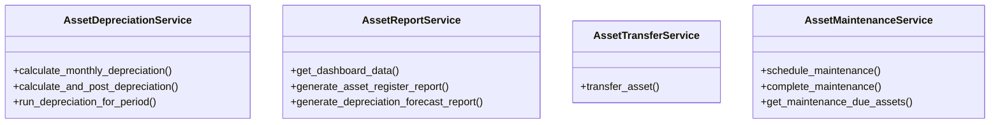

# business_modules.assets.services

## Imports
- datetime
- decimal
- django.db
- django.db.models
- django.db.models.functions
- django.utils
- django.utils.translation
- models

## Classes
- AssetDepreciationService
  - method: `calculate_monthly_depreciation`
  - method: `calculate_and_post_depreciation`
  - method: `run_depreciation_for_period`
- AssetReportService
  - method: `get_dashboard_data`
  - method: `generate_asset_register_report`
  - method: `generate_depreciation_forecast_report`
- AssetTransferService
  - method: `transfer_asset`
- AssetMaintenanceService
  - method: `schedule_maintenance`
  - method: `complete_maintenance`
  - method: `get_maintenance_due_assets`

## Functions
- calculate_monthly_depreciation
- calculate_and_post_depreciation
- run_depreciation_for_period
- get_dashboard_data
- generate_asset_register_report
- generate_depreciation_forecast_report
- transfer_asset
- schedule_maintenance
- complete_maintenance
- get_maintenance_due_assets

## Class Diagram

