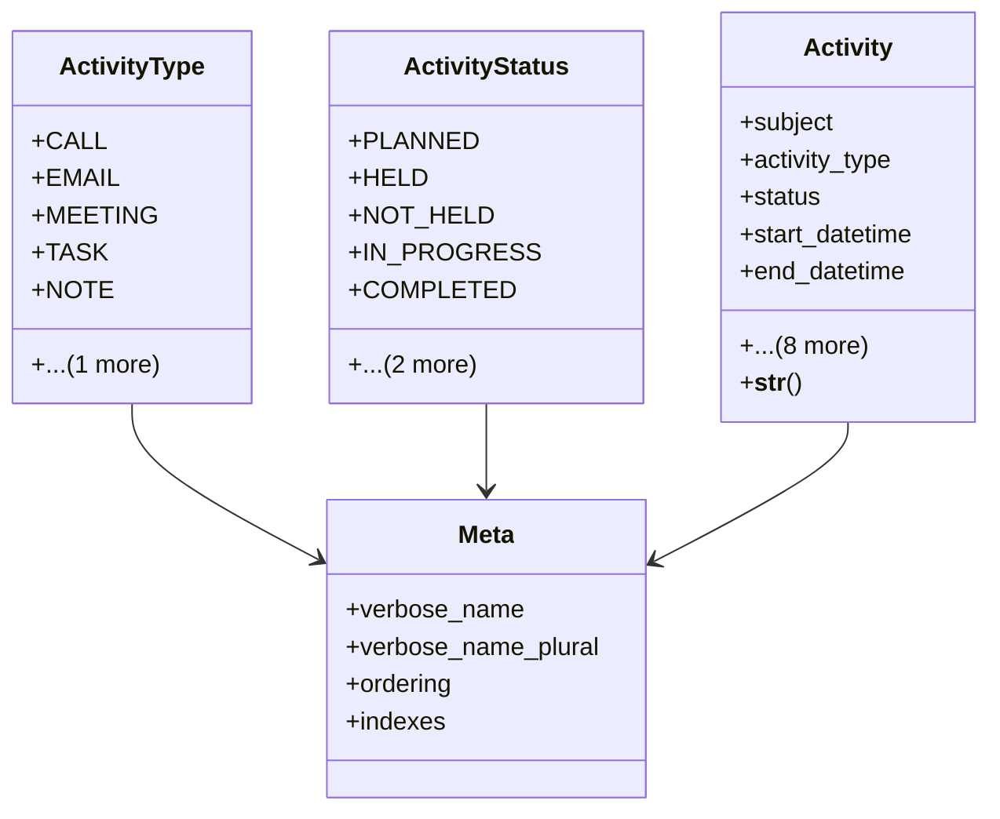

# business_modules.contacts.activities

## Imports
- django.conf
- django.contrib.contenttypes.fields
- django.contrib.contenttypes.models
- django.db
- django.utils.translation

## Classes
- ActivityType
  - attr: `CALL`
  - attr: `EMAIL`
  - attr: `MEETING`
  - attr: `TASK`
  - attr: `NOTE`
  - attr: `OTHER`
- ActivityStatus
  - attr: `PLANNED`
  - attr: `HELD`
  - attr: `NOT_HELD`
  - attr: `IN_PROGRESS`
  - attr: `COMPLETED`
  - attr: `DEFERRED`
  - attr: `CANCELLED`
- Activity
  - attr: `subject`
  - attr: `activity_type`
  - attr: `status`
  - attr: `start_datetime`
  - attr: `end_datetime`
  - attr: `description`
  - attr: `assigned_to`
  - attr: `created_by`
  - attr: `content_type`
  - attr: `object_id`
  - attr: `related_object`
  - attr: `created_at`
  - attr: `updated_at`
  - method: `__str__`
- Meta
  - attr: `verbose_name`
  - attr: `verbose_name_plural`
  - attr: `ordering`
  - attr: `indexes`

## Functions
- __str__

## Module Variables
- `AUTH_USER_MODEL`
- `__all__`

## Class Diagram

