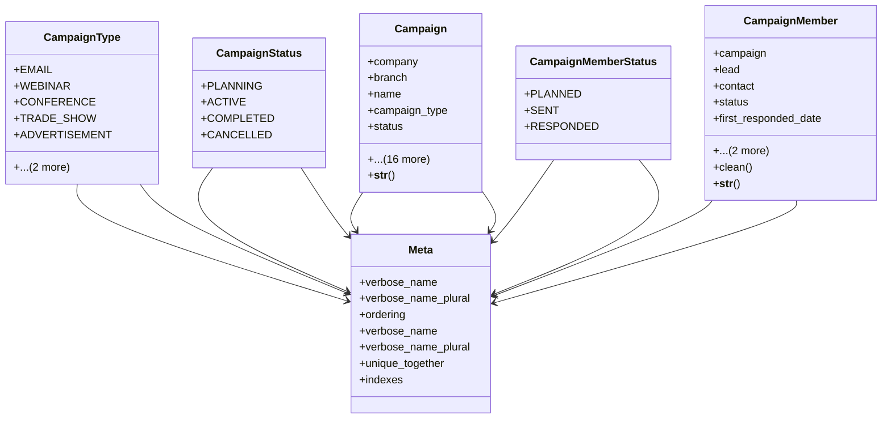

# business_modules.contacts.campaigns

## Imports
- core_modules.organization.models
- django.conf
- django.core.exceptions
- django.db
- django.utils.translation
- leads

## Classes
- CampaignType
  - attr: `EMAIL`
  - attr: `WEBINAR`
  - attr: `CONFERENCE`
  - attr: `TRADE_SHOW`
  - attr: `ADVERTISEMENT`
  - attr: `DIRECT_MAIL`
  - attr: `OTHER`
- CampaignStatus
  - attr: `PLANNING`
  - attr: `ACTIVE`
  - attr: `COMPLETED`
  - attr: `CANCELLED`
- Campaign
  - attr: `company`
  - attr: `branch`
  - attr: `name`
  - attr: `campaign_type`
  - attr: `status`
  - attr: `start_date`
  - attr: `end_date`
  - attr: `expected_revenue`
  - attr: `budgeted_cost`
  - attr: `actual_cost`
  - attr: `currency`
  - attr: `expected_response_rate`
  - attr: `description`
  - attr: `owner`
  - attr: `created_by`
  - attr: `num_sent`
  - attr: `num_responses`
  - attr: `num_leads_converted`
  - attr: `num_opportunities_created`
  - attr: `created_at`
  - attr: `updated_at`
  - method: `__str__`
- CampaignMemberStatus
  - attr: `PLANNED`
  - attr: `SENT`
  - attr: `RESPONDED`
- CampaignMember
  - attr: `campaign`
  - attr: `lead`
  - attr: `contact`
  - attr: `status`
  - attr: `first_responded_date`
  - attr: `created_at`
  - attr: `updated_at`
  - method: `clean`
  - method: `__str__`
- Meta
  - attr: `verbose_name`
  - attr: `verbose_name_plural`
  - attr: `ordering`
- Meta
  - attr: `verbose_name`
  - attr: `verbose_name_plural`
  - attr: `unique_together`
  - attr: `indexes`

## Functions
- __str__
- clean
- __str__

## Module Variables
- `AUTH_USER_MODEL`
- `__all__`

## Class Diagram

