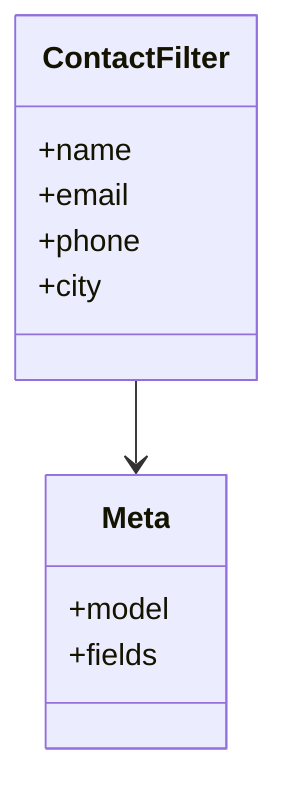

# business_modules.contacts.filters

## Imports
- django_filters
- models

## Classes
- ContactFilter
  - attr: `name`
  - attr: `email`
  - attr: `phone`
  - attr: `city`
- Meta
  - attr: `model`
  - attr: `fields`

## Class Diagram

