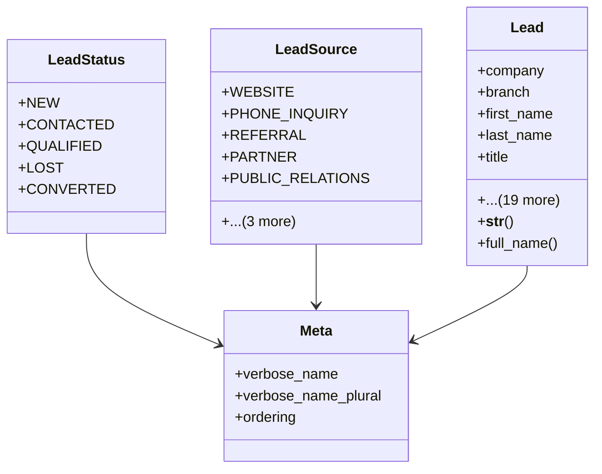

# business_modules.contacts.leads

## Imports
- core_modules.organization.models
- django.conf
- django.db
- django.utils.translation

## Classes
- LeadStatus
  - attr: `NEW`
  - attr: `CONTACTED`
  - attr: `QUALIFIED`
  - attr: `LOST`
  - attr: `CONVERTED`
- LeadSource
  - attr: `WEBSITE`
  - attr: `PHONE_INQUIRY`
  - attr: `REFERRAL`
  - attr: `PARTNER`
  - attr: `PUBLIC_RELATIONS`
  - attr: `TRADE_SHOW`
  - attr: `CAMPAIGN`
  - attr: `OTHER`
- Lead
  - attr: `company`
  - attr: `branch`
  - attr: `first_name`
  - attr: `last_name`
  - attr: `title`
  - attr: `organization_name`
  - attr: `email`
  - attr: `phone`
  - attr: `mobile_phone`
  - attr: `website`
  - attr: `address_line_1`
  - attr: `address_line_2`
  - attr: `city`
  - attr: `state_province`
  - attr: `postal_code`
  - attr: `country`
  - attr: `status`
  - attr: `source`
  - attr: `description`
  - attr: `assigned_to`
  - attr: `created_by`
  - attr: `converted_contact`
  - attr: `created_at`
  - attr: `updated_at`
  - method: `__str__`
  - method: `full_name`
- Meta
  - attr: `verbose_name`
  - attr: `verbose_name_plural`
  - attr: `ordering`

## Functions
- __str__
- full_name

## Module Variables
- `AUTH_USER_MODEL`
- `__all__`

## Class Diagram

