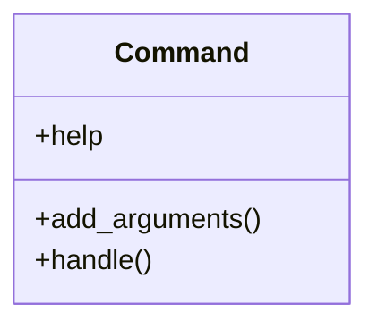

# business_modules.contacts.management.commands.create_sample_contacts

## Imports
- business_modules.contacts.models
- core_modules.companies.models
- django.core.management.base
- django.utils
- random

## Classes
- Command
  - attr: `help`
  - method: `add_arguments`
  - method: `handle`

## Functions
- add_arguments
- handle

## Class Diagram

