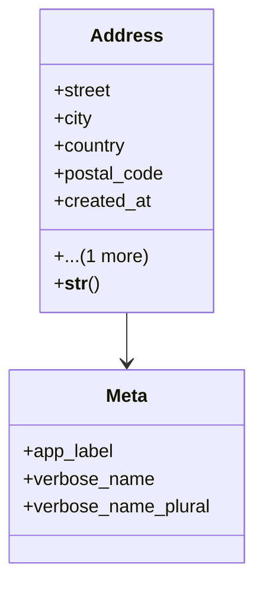

# business_modules.contacts.models.address

## Imports
- django.db
- django.utils.translation

## Classes
- Address
  - attr: `street`
  - attr: `city`
  - attr: `country`
  - attr: `postal_code`
  - attr: `created_at`
  - attr: `updated_at`
  - method: `__str__`
- Meta
  - attr: `app_label`
  - attr: `verbose_name`
  - attr: `verbose_name_plural`

## Functions
- __str__

## Class Diagram

