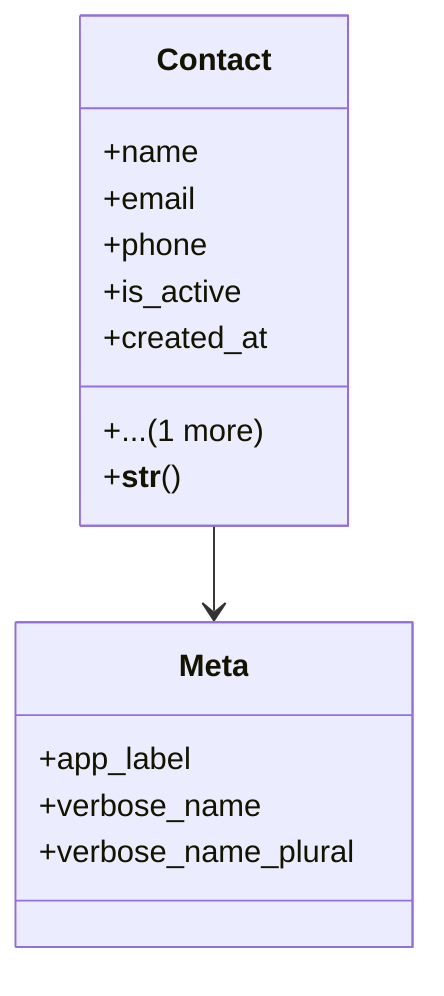

# business_modules.contacts.models.contact

## Imports
- django.db
- django.utils.translation

## Classes
- Contact
  - attr: `name`
  - attr: `email`
  - attr: `phone`
  - attr: `is_active`
  - attr: `created_at`
  - attr: `updated_at`
  - method: `__str__`
- Meta
  - attr: `app_label`
  - attr: `verbose_name`
  - attr: `verbose_name_plural`

## Functions
- __str__

## Class Diagram

