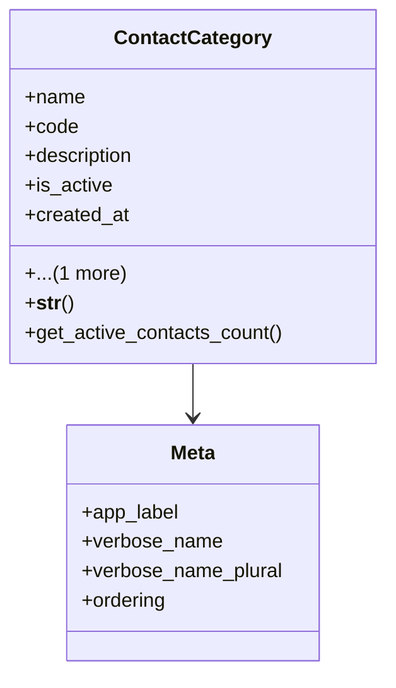

# business_modules.contacts.models.contact_category

## Imports
- contact
- django.db
- django.utils.translation

## Classes
- ContactCategory
  - attr: `name`
  - attr: `code`
  - attr: `description`
  - attr: `is_active`
  - attr: `created_at`
  - attr: `updated_at`
  - method: `__str__`
  - method: `get_active_contacts_count`
- Meta
  - attr: `app_label`
  - attr: `verbose_name`
  - attr: `verbose_name_plural`
  - attr: `ordering`

## Functions
- __str__
- get_active_contacts_count

## Class Diagram

