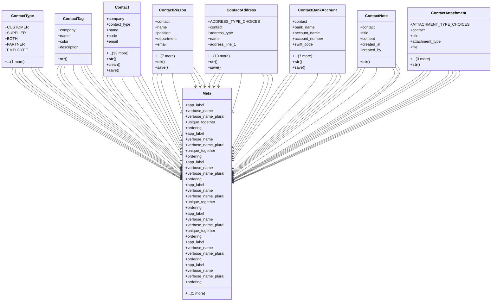

# business_modules.contacts.models

## Imports
- decimal
- django.conf
- django.core.exceptions
- django.db
- django.utils.translation

## Classes
- ContactType
  - attr: `CUSTOMER`
  - attr: `SUPPLIER`
  - attr: `BOTH`
  - attr: `PARTNER`
  - attr: `EMPLOYEE`
  - attr: `OTHER`
- ContactTag
  - attr: `company`
  - attr: `name`
  - attr: `color`
  - attr: `description`
  - method: `__str__`
- Contact
  - attr: `company`
  - attr: `contact_type`
  - attr: `name`
  - attr: `code`
  - attr: `email`
  - attr: `phone`
  - attr: `mobile`
  - attr: `website`
  - attr: `tax_id`
  - attr: `notes`
  - attr: `is_active`
  - attr: `tags`
  - attr: `address_line_1`
  - attr: `address_line_2`
  - attr: `city`
  - attr: `state_province`
  - attr: `postal_code`
  - attr: `country`
  - attr: `sales_person`
  - attr: `credit_limit`
  - attr: `payment_term_days`
  - attr: `CUSTOMER_STATUS_CHOICES`
  - attr: `CUSTOMER_GRADE_CHOICES`
  - attr: `CUSTOMER_STRUCTURE_TYPE_CHOICES`
  - attr: `customer_status`
  - attr: `customer_grade`
  - attr: `customer_structure_type`
  - attr: `SUPPLIER_RATING_CHOICES`
  - attr: `supplier_rating`
  - attr: `bank_name`
  - attr: `bank_account_name`
  - attr: `bank_account_number`
  - attr: `bank_swift_code`
  - attr: `bank_iban`
  - attr: `created_at`
  - attr: `updated_at`
  - attr: `created_by`
  - attr: `updated_by`
  - method: `__str__`
  - method: `clean`
  - method: `save`
- ContactPerson
  - attr: `contact`
  - attr: `name`
  - attr: `position`
  - attr: `department`
  - attr: `email`
  - attr: `phone`
  - attr: `mobile`
  - attr: `is_primary`
  - attr: `notes`
  - attr: `is_active`
  - attr: `created_at`
  - attr: `updated_at`
  - method: `__str__`
  - method: `save`
- ContactAddress
  - attr: `ADDRESS_TYPE_CHOICES`
  - attr: `contact`
  - attr: `address_type`
  - attr: `name`
  - attr: `address_line_1`
  - attr: `address_line_2`
  - attr: `city`
  - attr: `state_province`
  - attr: `postal_code`
  - attr: `country`
  - attr: `is_default`
  - attr: `phone`
  - attr: `notes`
  - attr: `created_at`
  - attr: `updated_at`
  - method: `__str__`
  - method: `save`
- ContactBankAccount
  - attr: `contact`
  - attr: `bank_name`
  - attr: `account_name`
  - attr: `account_number`
  - attr: `swift_code`
  - attr: `iban`
  - attr: `branch`
  - attr: `currency`
  - attr: `is_default`
  - attr: `notes`
  - attr: `created_at`
  - attr: `updated_at`
  - method: `__str__`
  - method: `save`
- ContactNote
  - attr: `contact`
  - attr: `title`
  - attr: `content`
  - attr: `created_at`
  - attr: `created_by`
  - method: `__str__`
- ContactAttachment
  - attr: `ATTACHMENT_TYPE_CHOICES`
  - attr: `contact`
  - attr: `title`
  - attr: `attachment_type`
  - attr: `file`
  - attr: `description`
  - attr: `created_at`
  - attr: `created_by`
  - method: `__str__`
- Meta
  - attr: `app_label`
  - attr: `verbose_name`
  - attr: `verbose_name_plural`
  - attr: `unique_together`
  - attr: `ordering`
- Meta
  - attr: `app_label`
  - attr: `verbose_name`
  - attr: `verbose_name_plural`
  - attr: `unique_together`
  - attr: `ordering`
  - attr: `indexes`
- Meta
  - attr: `app_label`
  - attr: `verbose_name`
  - attr: `verbose_name_plural`
  - attr: `ordering`
- Meta
  - attr: `app_label`
  - attr: `verbose_name`
  - attr: `verbose_name_plural`
  - attr: `unique_together`
  - attr: `ordering`
- Meta
  - attr: `app_label`
  - attr: `verbose_name`
  - attr: `verbose_name_plural`
  - attr: `unique_together`
  - attr: `ordering`
- Meta
  - attr: `app_label`
  - attr: `verbose_name`
  - attr: `verbose_name_plural`
  - attr: `ordering`
- Meta
  - attr: `app_label`
  - attr: `verbose_name`
  - attr: `verbose_name_plural`
  - attr: `ordering`

## Functions
- __str__
- __str__
- clean
- save
- __str__
- save
- __str__
- save
- __str__
- save
- __str__
- __str__

## Class Diagram

