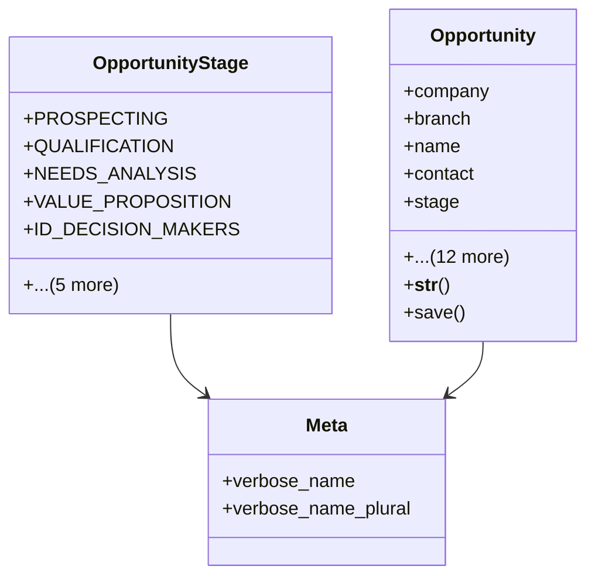

# business_modules.contacts.opportunities

## Imports
- core_modules.organization.models
- decimal
- django.conf
- django.db
- django.utils.translation
- leads

## Classes
- OpportunityStage
  - attr: `PROSPECTING`
  - attr: `QUALIFICATION`
  - attr: `NEEDS_ANALYSIS`
  - attr: `VALUE_PROPOSITION`
  - attr: `ID_DECISION_MAKERS`
  - attr: `PERCEPTION_ANALYSIS`
  - attr: `PROPOSAL_PRICE_QUOTE`
  - attr: `NEGOTIATION_REVIEW`
  - attr: `CLOSED_WON`
  - attr: `CLOSED_LOST`
- Opportunity
  - attr: `company`
  - attr: `branch`
  - attr: `name`
  - attr: `contact`
  - attr: `stage`
  - attr: `amount`
  - attr: `currency`
  - attr: `probability`
  - attr: `expected_revenue`
  - attr: `close_date`
  - attr: `description`
  - attr: `lead_source`
  - attr: `assigned_to`
  - attr: `created_by`
  - attr: `originating_lead`
  - attr: `created_at`
  - attr: `updated_at`
  - method: `__str__`
  - method: `save`
- Meta
  - attr: `verbose_name`
  - attr: `verbose_name_plural`

## Functions
- __str__
- save

## Class Diagram

