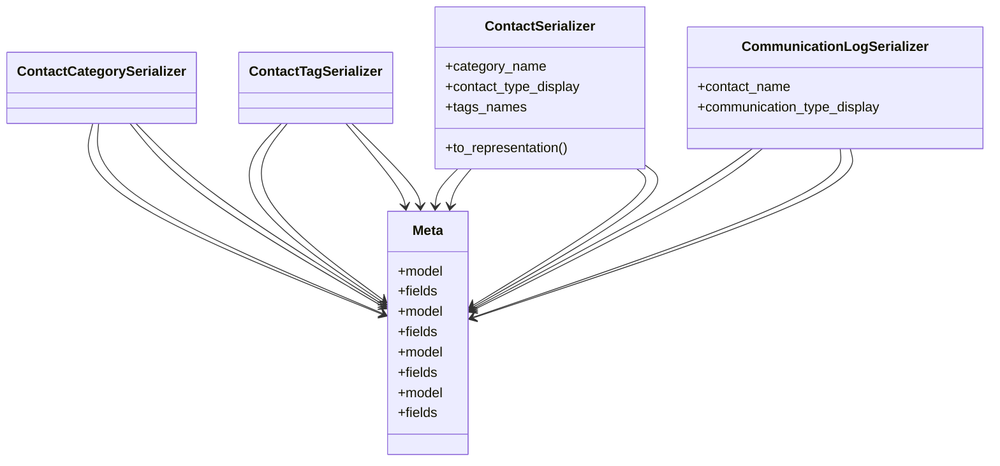

# business_modules.contacts.serializers

## Imports
- admin_modules.communication.models
- models
- rest_framework

## Classes
- ContactCategorySerializer
- ContactTagSerializer
- ContactSerializer
  - attr: `category_name`
  - attr: `contact_type_display`
  - attr: `tags_names`
  - method: `to_representation`
- CommunicationLogSerializer
  - attr: `contact_name`
  - attr: `communication_type_display`
- Meta
  - attr: `model`
  - attr: `fields`
- Meta
  - attr: `model`
  - attr: `fields`
- Meta
  - attr: `model`
  - attr: `fields`
- Meta
  - attr: `model`
  - attr: `fields`

## Functions
- to_representation

## Class Diagram

