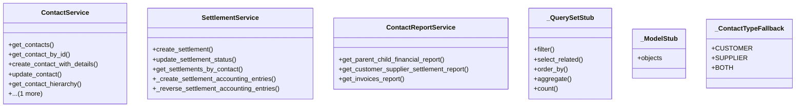

# business_modules.contacts.services

## Imports
- business_modules.accounting.models
- business_modules.accounting.services.journal_service
- business_modules.contacts.models
- business_modules.purchasing.models
- business_modules.sales.models
- decimal
- django.db
- django.db.models
- django.utils.translation
- models

## Classes
- ContactService
  - method: `get_contacts`
  - method: `get_contact_by_id`
  - method: `create_contact_with_details`
  - method: `update_contact`
  - method: `get_contact_hierarchy`
  - method: `get_contact_financial_summary`
- SettlementService
  - method: `create_settlement`
  - method: `update_settlement_status`
  - method: `get_settlements_by_contact`
  - method: `_create_settlement_accounting_entries`
  - method: `_reverse_settlement_accounting_entries`
- ContactReportService
  - method: `get_parent_child_financial_report`
  - method: `get_customer_supplier_settlement_report`
  - method: `get_invoices_report`
- _QuerySetStub
  - method: `filter`
  - method: `select_related`
  - method: `order_by`
  - method: `aggregate`
  - method: `count`
- _ModelStub
  - attr: `objects`
- _ContactTypeFallback
  - attr: `CUSTOMER`
  - attr: `SUPPLIER`
  - attr: `BOTH`

## Functions
- create_journal_entry
- get_contacts
- get_contact_by_id
- create_contact_with_details
- update_contact
- get_contact_hierarchy
- get_contact_financial_summary
- create_settlement
- update_settlement_status
- get_settlements_by_contact
- _create_settlement_accounting_entries
- _reverse_settlement_accounting_entries
- get_parent_child_financial_report
- get_customer_supplier_settlement_report
- get_invoices_report
- filter
- select_related
- order_by
- aggregate
- count

## Module Variables
- `ContactDetail`
- `SupplierContactPerson`
- `AddressType`
- `ContactDetailType`
- `SettlementTransaction`
- `__all__`

## Class Diagram

